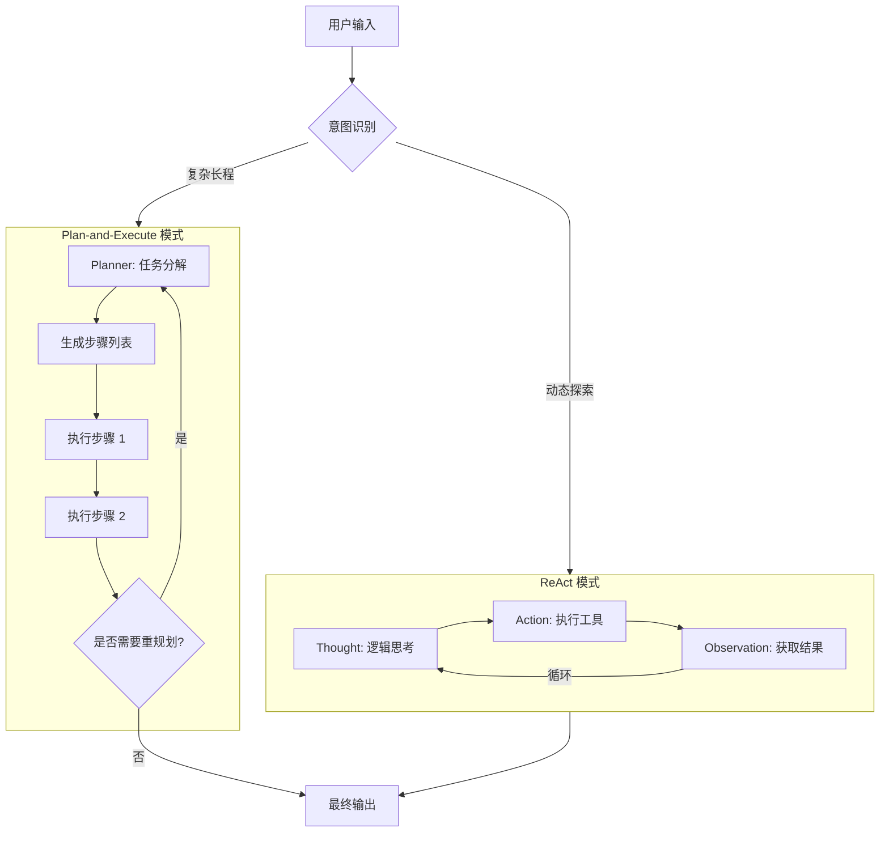

# AI Agent 架构与框架全景指南

在 2025-2026 年的 AI 生态中，Agent 的开发已从简单的 Prompt 工程转向系统化的架构设计。本笔记涵盖了主流的开发框架及核心的推理/执行架构模式。

## 1. 核心架构模式 (Architectural Patterns)

Agent 的架构决定了其“思考”与“行动”的逻辑组织方式。

### 1.1 ReAct (Reasoning + Acting)
*   **论文依据**：Yao et al., ICLR 2023。
*   **核心逻辑**：将推理和行动合并到一个循环中。模型生成 Thought（思考），输出 Action（工具调用），接收 Observation（环境观察），周而复始。
*   **优势**：自适应强，能够根据环境反馈实时调整。
*   **劣势**：易陷入无限循环，且对于极其复杂的长程任务缺乏全局把控。
*   **相关实现**：[[LangGraph-ReAct-Agent实战指南]]。

### 1.2 Plan-and-Execute (规划与执行分离)
*   **核心逻辑**：
    1.  **Planner**：将高层目标分解为原子化的步骤列表。
    2.  **Executor**：按顺序执行步骤，每步完成后可触发 **Re-planner** 更新计划。
*   **优势**：逻辑严密，适合不可逆操作和多步骤复杂流程。
*   **劣势**：响应延迟较高（需要先生成完整计划），灵活性略逊于 ReAct。

### 1.3 其他进阶模式
| 架构模式 | 核心描述 | 典型应用 |
| :--- | :--- | :--- |
| **Reflexion** | 在执行后增加“自我反思”环节，根据失败经验修正策略。 | 代码生成、科学研究。 |
| **Tree of Thoughts** | 探索多条推理分支，对每条路径评分并择优。 | 数学证明、复杂博弈。 |
| **Prompt Chaining** | 固定的、线性的多步 Prompt 传递，不具备动态决策。 | 固定流程的数据 pipeline。 |
| **Routing** | 预分类意图，然后路由到专门的 Agent 或工具。 | 智能客服、多功能助手。 |

### 1.4 混合架构 (Hybrid Architecture: P&E + ReAct)
*   **定义**：将 Plan-and-Execute 作为全局调度，ReAct 作为局部执行器。
*   **工作模式**：
    1.  **上层 (Macro-Planner)**：负责将任务分解为 $N$ 个步骤，不涉及具体工具参数。
    2.  **下层 (Micro-Executor)**：每个步骤由一个独立的 ReAct 循环完成，具备局部自适应和纠错能力。
*   **核心优势**：
    *   **鲁棒性**：局部错误（如工具调用失败）由 ReAct 内部消化。
    *   **可解释性**：全局计划清晰可见，局部细节高度动态。
    *   **Token 优化**：避免了将所有工具说明和长轨迹都塞进一个 Context 中。
*   **适用场景**：深度市场调研、自动化软件开发、多阶段科学实验模拟。

## 2. 逻辑流程可视化 (Logic Flow)

## 3. 2025 主流 Agent 开发框架对比

| 框架 | 核心定位 | 语言 | 特色 |
| :--- | :--- | :--- | :--- |
| **LangGraph** | 状态机/图架构 | Python/JS | 细粒度控制，支持循环和 Human-in-the-loop。 |
| **CrewAI** | 角色驱动协作 | Python | 模拟人类团队（Manager, Worker），上手极快。 |
| **LlamaIndex** | RAG 增强型 | Python/TS | 专注于私有数据检索与 Agent 推理的结合。 |
| **AutoGen** | 对话式多 Agent | Python | 擅长模拟多个 Agent 之间的辩论与对话。 |
| **Pydantic AI** | 类型安全架构 | Python | 基于 Pydantic 的严谨数据验证，适合生产环境。 |
| **Mastra** | TS 原生框架 | TypeScript | 前端友好，声明式配置。 |

## 4. 选型建议

1.  **如果你需要严密的逻辑控制**：选择 **LangGraph**。
2.  **如果你需要快速搭建多角色团队**：选择 **CrewAI**。
3.  **如果核心场景是查文档(RAG)**：选择 **LlamaIndex**。
4.  **如果你在构建高度确定性的 Pipeline**：使用 **Prompt Chaining** 或 **Routing**。

## 参考链接
- [ReAct: Synergizing Reasoning and Acting](https://react-lm.github.io/)
- [Plan-and-Solve Prompting (Wang et al. 2023)](https://arxiv.org/abs/2305.04091)
- [[Agent运行机制详解]]
- [[LangGraph-ReAct-Agent实战指南]]

## Update History
- 2026-04-11: 补充“混合架构 (P&E + ReAct)”章节，详述其分层控制逻辑与优势。
- 2026-04-11: 初次创建，整合 ReAct、Plan-and-Execute 架构及 2025 框架对比。
