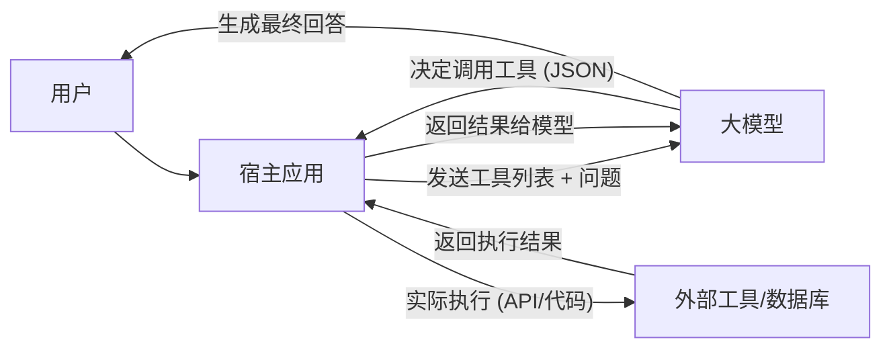

# LLM Skills 技术全景指南

LLM Skills（也称为 Tool Use 或 Function Calling）是构建 AI Agent 的基石。它赋予了模型与现实世界交互的能力。

## 1. 核心架构：调度员模式 (Dispatcher Pattern)

在 Tool Calling 架构中，LLM 的角色是**智能调度员**，而非执行者。

## 2. 标准协议：MCP (Model Context Protocol)

MCP 是目前最前沿的工具标准化协议，由 Anthropic 推出。

- **Host (宿主)**: 如 IDE、AI 助手桌面端。
- **Client (客户端)**: 建立连接并遵循协议。
- **Server (服务端)**: 开发者编写的轻量程序，提供 Tools, Resources 和 Prompts。

## 3. 进阶概念：Agent Skills (能力封装)

[AgentSkills.io](https://agentskills.io) 提出了一种不同于纯 API 调用的能力封装方式。如果说 MCP 是智能体的“手”，那么 Agent Skills 就是智能体的“专业书籍”。

### 核心特性：渐进式披露 (Progressive Disclosure)
为了解决大模型上下文窗口（Context Window）的浪费问题，Agent Skills 采用三级加载机制：
1. **Level 1 (Metadata)**: 始终加载。仅包含技能名称和简介，供模型判断是否需要该技能。
2. **Level 2 (Instructions)**: 按需加载。模型决定使用技能后，才会读取 `SKILL.md` 中的详细 SOP 指令。
3. **Level 3 (Scripts/Resources)**: 运行时加载。只有在执行特定步骤需要运行代码（Python/JS）或引用模版时才读取。

### Agent Skills vs. MCP
- **MCP** 关注“连接”：解决如何访问私有数据和 API。
- **Agent Skills** 关注“逻辑”：解决如何按照特定标准和流程去执行任务。

## 4. 实现原理：Function Calling

模型通过 `system_prompt` 或特定的 `tools` 参数获知可选工具的描述。

### 关键组件
- **JSON Schema**: 定义函数名、参数类型、必填项。
- **Call ID**: 用于在异步交互中追踪哪个结果对应哪个请求。
- **Thinking Process**: 现代模型（如 DeepSeek-R1）在调用工具前通常会有 CoT 思考过程。

## 4. 生产级最佳实践

- **提示词工程**: 在工具描述中加入“调用建议”和“错误处理示例”。
- **安全沙箱**: 执行 LLM 生成的代码时必须在隔离环境运行。详见 [[Agent运行机制详解]]。
- **Token 优化**: 对工具返回的海量数据（如网页 HTML）进行摘要后再喂给模型。
- **幂等性**: 确保工具的写操作是幂等的，防止模型因重试或多次调用造成重复操作。

## 参考链接
- [Model Context Protocol (MCP) Official Site](https://modelcontextprotocol.io)
- [OpenAI Function Calling Guide](https://platform.openai.com/docs/guides/function-calling)
- [Anthropic Tool Use Documentation](https://docs.anthropic.com/en/docs/build-with-claude/tool-use)

## Update History
- 2026-02-28: 初次创建，整合 MCP 协议与 Function Calling 技术架构。
