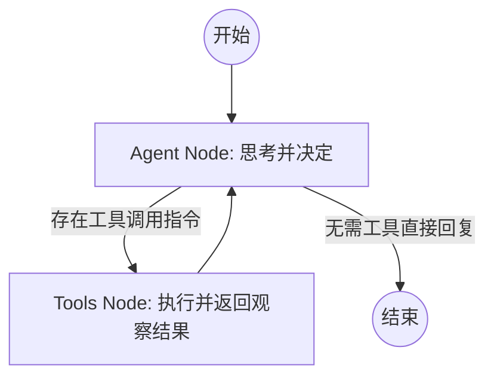

# LangGraph ReAct Agent 实战指南

ReAct (Reason + Act) 是 Agent 最基础的运行模式。LangGraph 通过状态机（State Machine）的思想，将这一模式工程化，解决了传统链路（Chain）难以处理的循环（Loop）问题。

## 1. 运行逻辑架构

ReAct Agent 的核心是一个由状态（State）驱动的闭环。



## 2. 核心概念

- **State (状态)**: 图中流转的数据结构，通常包含 `messages` 序列。
- **Nodes (节点)**: 执行具体逻辑的函数（如调用 LLM 或执行 Python 代码）。
- **Edges (边)**: 连接节点的路径。
- **Conditional Edges (条件边)**: 根据当前状态决定下一步走向（例如：有工具调用则去 `Tools`，否则 `END`）。

## 3. 实现方案对比

### A. 高层封装：`create_react_agent` (推荐)
适用于标准 ReAct 循环，支持并行工具调用、持久化内存和人工介入。

```python
from langgraph.prebuilt import create_react_agent
from langchain_openai import ChatOpenAI
from langchain_core.tools import tool

@tool
def get_weather(city: str):
    """获取天气信息"""
    return f"{city} 的天气是晴天。"

model = ChatOpenAI(model="gpt-4o")
# 一行代码构建完整的 ReAct 图
app = create_react_agent(model, [get_weather])
```

### B. 底层构建：`StateGraph` (深度定制)
适用于需要精细控制状态更新或多 Agent 协作的场景。

```python
from langgraph.graph import StateGraph, START, END, MessagesState
from langgraph.prebuilt import ToolNode, tools_condition

# 1. 定义图
workflow = StateGraph(MessagesState)

# 2. 定义节点逻辑（Agent 节点）
def call_model(state: MessagesState):
    response = model.invoke(state["messages"])
    return {"messages": [response]}

# 3. 添加节点
workflow.add_node("agent", call_model)
workflow.add_node("tools", ToolNode(tools))

# 4. 设置连接线
workflow.add_edge(START, "agent")
workflow.add_conditional_edges("agent", tools_condition)
workflow.add_edge("tools", "agent")

app = workflow.compile()
```

### C. 配置 System Prompt
无论是哪种方案，都可以通过以下方式定义 Agent 的“人格”：

- **在 `create_react_agent` 中**：使用 `state_modifier` 参数。
  ```python
  app = create_react_agent(model, tools, state_modifier="你是一个专业的 AI 助手。")
  ```
- **在手动构建中**：在节点函数内手动将 `SystemMessage` 插入消息列表头部。
  ```python
  from langchain_core.messages import SystemMessage

  def call_model(state: MessagesState):
      # 手动注入系统提示词
      prompt = [SystemMessage(content="你是一个编程专家。")]
      messages = prompt + state["messages"]
      response = model.invoke(messages)
      return {"messages": [response]}
  ```

### D. 记忆管理 (Memory & Persistence)
LangGraph 的核心优势在于原生支持状态持久化，这通过 **Checkpointer** 机制实现。

1. **短期记忆（Thread-level）**：
   使用 `thread_id` 隔离不同的会话。
   ```python
   from langgraph.checkpoint.memory import MemorySaver
   
   memory = MemorySaver()
   app = workflow.compile(checkpointer=memory)
   
   # 调用时指定 thread_id
   config = {"configurable": {"thread_id": "1"}}
   app.invoke(input_data, config)
   ```

2. **长期记忆（Cross-thread）**：
   通常需要在图中设计一个“记忆节点”，将重要信息存储到向量数据库或传统的 NoSQL 数据库中，并在下次会话开始时检索。

## 4. 为什么选择 LangGraph 实现 ReAct？

1. **可控性**：相比于完全黑盒的 Agent 框架，LangGraph 允许你看到并修改图中的每一个步骤。
2. **持久化 (Persistence)**：原生支持 Checkpointer，可以轻松实现对话中断后的恢复。
3. **循环处理**：[[Agent运行机制详解]] 中提到的 ReAct 循环在 LangGraph 中通过递归边（Recursive Edges）得到了完美的工程化支持。

## 参考链接
- [LangGraph How-to Guides](https://langchain-ai.github.io/langgraph/how-tos/)
- [ReAct 原理深度解析](https://arxiv.org/abs/2210.03629)

## Update History
- 2026-03-19: 修复因操作失误导致的“手动构建”章节丢失，补充 System Prompt 在节点内的代码实现细节。
- 2026-03-19: 增加 System Prompt 配置方法。
- 2026-03-19: 初次创建，涵盖预置 API 与手动构建两种方案。
