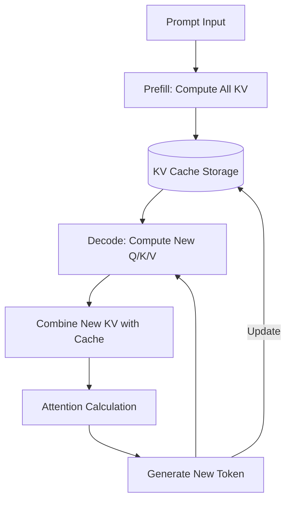

# KV Cache 技术详解

## 1. 核心定义
**KV Cache (Key-Value Cache)** 是大语言模型（LLM）推理优化的核心技术，通过缓存 Transformer 模型注意力机制中前文 Token 的 Key (K) 和 Value (V) 向量，避免在逐个生成 Token 的自回归过程中进行重复计算。

## 2. 工作原理
LLM 生成是逐个 Token 进行的自回归过程。

### 2.1 为什么需要缓存？
在没有缓存的情况下，生成第 $n$ 个 Token 时，模型需要对前 $n-1$ 个 Token 重新进行一次完整的 Self-Attention 计算，其计算量随序列长度呈平方级（$O(N^2)$）增长。

### 2.2 推理阶段划分
- **Prefill (预填充)**：处理 Prompt，计算所有输入 Token 的 K 和 V 并存入 Cache。
- **Decode (解码)**：逐个产出 Token，每步仅计算当前 Token 的 K 和 V，并从 Cache 读取历史数据进行注意力运算。此阶段受显存带宽限制（Memory-bound）。

## 3. 架构演进与优化

### 3.1 内存压缩 (Memory Reduction)
- **MHA (Multi-Head Attention)**：标准多头，KV Cache 随头数线性增长，显存压力大。
- **MQA (Multi-Query Attention)**：所有 Q 头共享一组 K/V。极致压缩，但有精度损耗。
- **GQA (Grouped-Query Attention)**：分组共享，Llama 3 等主流模型的选择，效率与精度的平衡。
- **MLA (Multi-head Latent Attention)**：DeepSeek V2/V3 创新，利用低秩投影对“头维度”进行压缩。
- **CSA/HCA (Compressed Attention)**：DeepSeek V4 引入，转向“序列维度”压缩（4x-128x），支撑百万级上下文。

### 3.2 显存管理 (PagedAttention)
传统的显存分配由于预分配（按 Max Length）和请求长度不可知，导致 60% 以上的碎片浪费。
- **vLLM / PagedAttention**：借鉴操作系统分页机制，将 KV Cache 离散化存储在 Block 中，提升显存利用率至 96% 以上。

## 4. 逻辑流程

## 5. 与 FlashAttention 的区别
- **KV Cache**：算法层面的“空间换时间”，解决重复计算。
- **FlashAttention**：硬件层面的“IO 优化”，解决 GPU 显存读写瓶颈。

## 6. Update History
- 2026-05-11: 初次创建，包含基本原理、GQA、PagedAttention 等深度内容。

## 参考链接
- [vLLM: PagedAttention Explained](https://blog.vllm.ai/2023/06/20/vllm.html)
- [[Transformer架构详解]]
- [[DeepSeek-R1技术秘诀]]
