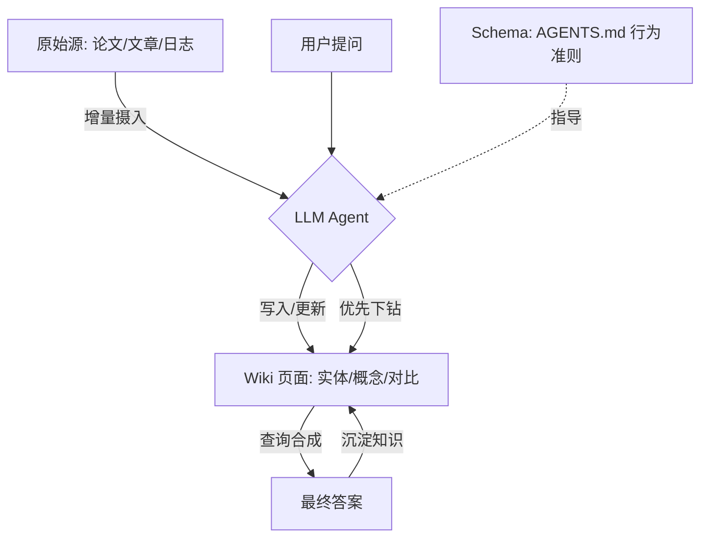

# Karpathy LLM Wiki 理念深度解析

由 Andrej Karpathy 提出的 **LLM Wiki** 是一种新型的个人/团队知识库构建模式。其核心理念是：**将 LLM 从“临时的检索器”转变为“持久的维基维护者”**。

## 1. 核心痛点：传统 RAG 的“西西弗斯陷阱”

Karpathy 指出，目前的 RAG（检索增强生成）系统存在严重的效率与深度瓶颈：
-   **无累积性**：LLM 每次回答问题都要从原始文档中重新挖掘知识（Rediscovering knowledge from scratch）。
-   **碎片化**：RAG 只能看到文档的切片（Chunks），难以处理需要跨多篇文档深度合成（Synthesis）的复杂问题。
-   **高维护成本**：人类难以维持大规模维基的交叉引用和一致性（Bookkeeping cost），导致知识库最终走向荒废。

## 2. LLM Wiki 的三层架构

该模式将知识库抽象为三个互动的层次：

| 层次 | 名称 | 属性 | 作用 |
| :--- | :--- | :--- | :--- |
| **底层** | **Raw Sources (原始源)** | 不可变 (Immutable) | 真理的来源（论文、文章、对话记录）。LLM 只读不写。 |
| **中层** | **The Wiki (维基层)** | 动态编译 (Compiled) | LLM 生成的 Markdown 集合。包含实体页、概念对比、全局综述。 |
| **顶层** | **The Schema (协议层)** | 进化中 (Evolving) | 规定 Agent 行为的指令（如 `AGENTS.md`）。定义了归档、命名与纠错的纪律。 |

## 3. 核心操作流程 (Operations)

### 3.1 增量摄入 (Incremental Ingest)
当新文档进入时，LLM 不是简单的索引，而是执行“编译”：
-   阅读新文档，提取核心结论。
-   **全局同步**：更新受影响的 10-15 个维基页面，建立交叉链接 `[[双向链接]]`。
-   **冲突检测**：标注新信息与既有笔记的矛盾点。

### 3.2 深度查询 (Synthesized Query)
-   LLM 优先检索维基层（已预处理的知识），而非直接翻阅原始文档。
-   **结果回流**：高质量的查询回答会被自动写回维基，作为新的“合成页面”永久保存。

### 3.3 自动化巡检 (Linting)
-   LLM 定期扫描维基，寻找：孤立页面、陈旧信息、未定义的引用、逻辑冲突。

## 4. 逻辑架构可视化

## 5. 为什么这能奏效？

Karpathy 认为，**“簿记成本（Bookkeeping cost）”**是阻碍人类维护知识库的唯一原因。
-   人类不擅长记忆所有文件间的微小关联。
-   LLM 不会感到疲倦，能够在一秒钟内修改 15 个文件的交叉引用。
-   **结论**：当维护成本降为零时，知识的累积效应就会产生质变，维基将成为一个具有“长期记忆”的外部大脑。

## 参考链接
- [Andrej Karpathy's LLM Wiki Gist](https://gist.github.com/karpathy/442a6bf555914893e9891c11519de94f)
- [[Agent运行机制详解]]
- [[AI-Agent-架构与框架全景指南]]

## Update History
- 2026-04-11: 初次创建。基于 Karpathy 的 Gist 深度解析 LLM Wiki 的三层架构与操作闭环。
