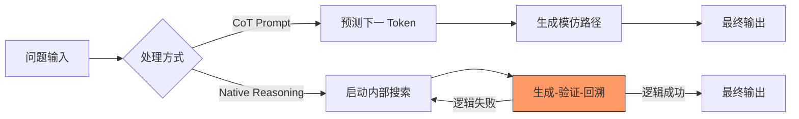

# 原生推理 (Native Reasoning) 与 CoT 提示词深度对比

在学习 LLM 逻辑演进时，理解 **原生推理能力**（以 OpenAI o1, DeepSeek-R1 为代表）与 **CoT 提示词技术**（以 "Let's think step by step" 为代表）的区别至关重要。

## 1. 技术范式的根本转变

### 1.1 CoT Prompting：模式模仿
*   **机制**：利用 LLM 的预测下一 Token 的本能。当提示词中包含“逐步思考”时，模型在海量预训练数据中检索类似的结构化文本模式进行填充。
*   **瓶颈**：缺乏真正的“自我校对”。如果第一步推导错误，由于自回归生成的特性，模型往往会为了维持序列的概率合理性而“一本正经地胡说八道”。

### 1.2 Native Reasoning：逻辑求索
*   **机制**：通过 **强化学习 (RL)** 训练。模型在内部（Scratchpad）进行大规模搜索。
*   **关键算法**：如 DeepSeek 的 **GRPO**。它不只是模仿，而是通过“奖励”那些最终导向正确答案且逻辑自洽的路径，让模型自发演化出推理能力。
*   **关联概念**：[[推理模型与System2思考机制详解]]

## 2. 监督机制：结果 vs. 过程

| 维度 | 结果监督 (Outcome Supervision / ORM) | 过程监督 (Process Supervision / PRM) |
| :--- | :--- | :--- |
| **评判对象** | 仅看最终答案是否正确 | 评判推理思维链中的每一个中间步骤 |
| **主要用途** | 传统 SFT 和早期 RLHF | 原生推理模型的强化训练 (如 o1) |
| **副作用** | **奖励黑客 (Reward Hacking)**：模型学会通过错误逻辑凑出正确答案 | **高昂标注成本**：需要对每一步逻辑进行精准打分 |

## 3. 推理侧缩放定律 (Inference-time Scaling)

这是原生推理模型最显著的特征。
*   **传统 Scaling Law**：更多的训练数据 + 更多的参数 = 更强的模型。
*   **新 Scaling Law**：更多的 **测试时计算 (Test-time Compute)** = 更强的逻辑。
    *   模型可以通过增加“思考 Token”的数量，在推理阶段换取性能提升。

## 4. 总结对比图

## 参考链接
- [DeepSeek-R1 技术报告](https://github.com/deepseek-ai/DeepSeek-R1)
- [OpenAI o1 介绍](https://openai.com/o1/)
- [[DeepSeek-R1深度解析]]

## Update History
- 2026-02-13: 初次创建，系统梳理原生推理与 CoT 的三大核心区别。
