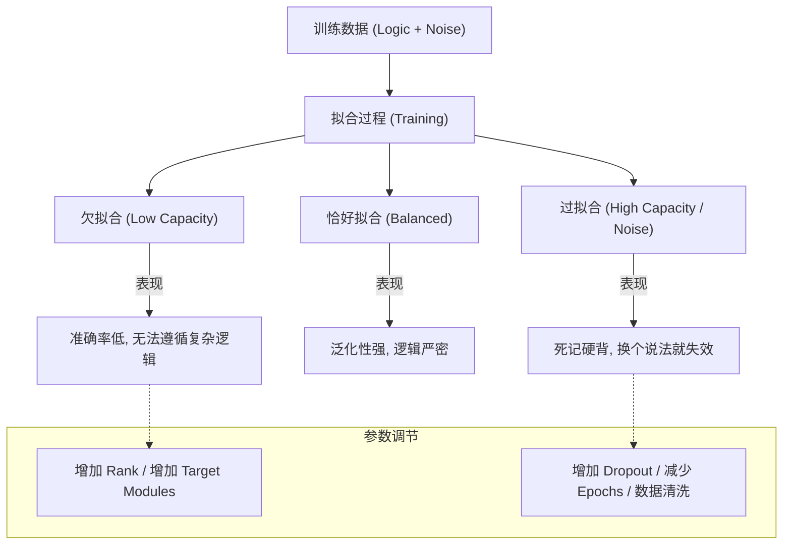

# 拟合机制深度解析

在机器学习和大型语言模型（LLM）微调的语境下，**“拟合”（Fitting）** 是描述模型学习能力与数据规律之间匹配程度的核心概念。理解拟合机制，是解决模型“学不进”、“学太死”或“逻辑崩塌”等问题的关键。

---

## 1. 拟合的数学本质：函数逼近 (Functional Approximation)

从数学的角度看，任何机器学习模型（包括百亿参数的 LLM）本质上都是一个复杂的**数学函数** $f(x; \theta)$，其中 $x$ 是输入，$\theta$ 是模型的可调参数。

### 1.1 拟合的定义
**拟合**是指通过调整参数 $\theta$，使得模型输出 $f(x)$ 能够尽可能准确地模拟客观世界中某种复杂规律（标签 $y$）的过程。

### 1.2 数学目标
我们的目标是最小化**损失函数（Loss Function）** $L$：
$$\theta^* = \arg \min_{\theta} \mathbb{E}_{(x,y) \sim \mathcal{D}} [L(f(x; \theta), y)]$$
- **训练过程**：即“拟合过程”，模型通过梯度下降（Gradient Descent）不断修正 $\theta$，试图在坐标系中画出一条能够穿过所有训练数据点的“曲线”。

---

## 2. 拟合的三种状态：频谱分析

拟合并非越强越好，它存在一个从“能量不足”到“能量过剩”的频谱。

### 2.1 欠拟合 (Underfitting)：能力不足
- **定义**：模型过于简单，无法捕捉数据中的基本规律。
- **视觉特征**：在坐标系中，规律是一条曲线，但模型只画出了一条直线。
- **LLM 实战表现**：
    - 训练集和测试集的准确率都很低。
    - 模型无法遵循复杂指令。
    - **典型案例**：你目前的微调任务中，`r=8` 导致模型“脑容量”不足，无法拟合 7000 条数据的逻辑，表现为 75% 的低准确率。

### 2.2 恰好拟合 (Good Fitting)：理想状态
- **定义**：模型成功捕捉了数据的潜在规律，并具备良好的**泛化能力（Generalization）**。
- **视觉特征**：曲线平滑地穿过数据点，忽略了随机噪声，抓住了本质逻辑。
- **LLM 实战表现**：模型能完美回答训练集问题，且面对未见过的新问题时，逻辑依然自洽。

### 2.3 过拟合 (Overfitting)：死记硬背
- **定义**：模型过于复杂，把数据中的**随机噪声**也当成规律学了进去。
- **视觉特征**：曲线为了穿过每一个数据点，变得极度扭曲、尖锐。
- **LLM 实战表现**：
    - 训练集准确率 100%，但测试集表现极差。
    - 模型失去了灵活对话的能力，只会机械重复训练集里的原话。

---

## 3. 核心概念：模型容量 (Model Capacity)

**拟合能力**的上限由**模型容量**决定。

### 3.1 什么是容量？
模型容量是指模型能够拟合的函数集合的复杂程度。
- **在 LoRA 中**：`Rank (r)` 直接决定了容量。`r=8` 是低容量，`r=128` 是高容量。
- **在全参数中**：参数量（如 7B, 70B）决定了原生容量。

### 3.2 容量与逻辑复杂度的关系
- **简单逻辑**（如语气模仿）：低容量即可拟合。
- **复杂逻辑**（如多步骤推理、代码生成）：需要高容量来构建复杂的非线性映射链路。

---

## 4. 拟合机制可视化 (Mermaid)

---

## 5. LLM 微调中的特有拟合问题

### 5.1 知识冲突导致的拟合阻力
当微调数据（1+1=3）与预训练常识（1+1=2）冲突时，模型会产生巨大的拟合阻力，表现为 Loss 无法下降，这是一种特殊的“语义欠拟合”。

### 5.2 灾难性遗忘 (Catastrophic Forgetting)
过拟合的变种。模型在极度拟合新任务（任务 B）时，破坏了原有的泛化结构（任务 A），导致基础能力坍塌。

---

## 6. 如何实现“完美拟合”？—— 调优策略

针对你目前的 75% 准确率困境，调优路径如下：

1.  **判定状态**：训练集准确率低 + 无法复现训练题 = **欠拟合**。
2.  **提升容量**：
    - 增加 **`LoRA Rank (r)`**（从 8 到 64+）。
    - 开启 **`all-linear`**（让更多大脑区域参与拟合）。
3.  **增加驱动力**：
    - 调高 **学习率 (Learning Rate)**。
    - 增加 **训练轮数 (Epochs)**。
4.  **数据纯化**：
    - 剔除自相矛盾的数据，减少模型在拟合时的“逻辑冲突”。

## 总结
**拟合不是终点，而是平衡的艺术。** 拟合能力越强，模型在复杂逻辑上的“建模精度”就越高。对于 7000 条数据的规模，目前你的任务是**通过提升 Rank 来释放模型的拟合潜力**。

## 参考链接
- [[LLM微调技术详解]]
- [[微调准确率低下诊断指南]]
- [Deep Learning Book - Capacity, Overfitting and Underfitting](https://www.deeplearningbook.org/contents/ml.html)

## Update History
- 2026-05-13: 初次创建，针对用户对“拟合能力”的疑问提供百科级深度解析。
