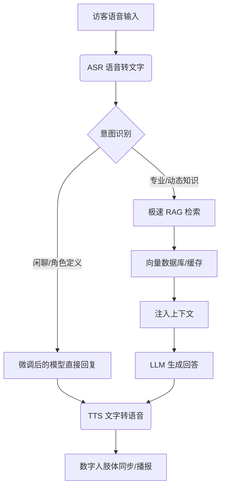

# 数字人展厅语音交互：RAG 对比微调技术方案分析

在展厅（Exhibition Hall）场景中，数字人通过语音唤醒与访客交互，核心挑战在于**实时性（低延迟）**、**准确性（无幻觉）**以及**品牌人格化（风格一致性）**。本报告针对 RAG（检索增强生成）与微调（Fine-Tuning）两种路径进行深度分析。

## 1. 技术架构概览

### 1.1 RAG (Retrieval-Augmented Generation)
RAG 像是一个“带开卷考试的考生”。在生成回答前，系统先从向量数据库（知识库）中检索相关文档，将其作为上下文喂给 LLM。

### 1.2 微调 (Fine-Tuning)
微调像是一个“经过专业训练的专家”。通过将特定领域的知识和风格注入模型参数，使其在没有外部参考的情况下也能直接回答。

---

## 2. 核心维度对比

| 维度 | RAG (检索增强) | Fine-Tuning (微调) |
| :--- | :--- | :--- |
| **知识时效性** | **极高**。更新向量库即可，秒级生效。 | **低**。每次知识更新需重新训练，成本高。 |
| **事实准确性** | **高**。有据可查，显著减少“幻觉”。 | **中**。容易产生看似专业的“一本正经胡说”。 |
| **角色/风格塑造** | 一般。主要依赖 Prompt 引导。 | **极强**。可深度定制语气、口吻和行业术语。 |
| **推理延迟** | 较高。需额外经历：向量计算 -> 检索 -> 注入。 | **低**。模型直接推理，无额外检索步骤。 |
| **实施成本** | 较低。核心成本在数据库维护与算力消耗。 | 较高。需要大量高质量标注数据及训练算力。 |

---

## 3. 展厅场景痛点分析

1.  **语音交互的“金三秒”**：访客在展厅提问后，如果响应超过 2-3 秒，交互感会大幅下降。
    *   *挑战*：RAG 的检索链路（ASR -> 语义向量化 -> 检索 -> LLM -> TTS）容易造成延迟堆积。
2.  **内容更新频繁**：展厅展项、活动安排、领导视察名单经常变动。
    *   *优势*：RAG 无需重新训练即可同步最新动态。
3.  **品牌专业性**：数字人需要代表企业形象，用词必须符合企业文化。
    *   *优势*：微调能让模型内化企业的话术风格。

---

## 4. 推荐方案：混合架构 (Hybrid Approach)

对于高性能展厅数字人，推荐采用 **“轻量化微调 + 极速 RAG”** 的混合方案。

### 4.1 混合架构图 (Mermaid)

### 4.2 实施策略
1.  **微调 (Persona)**：使用 LoRA 技术对模型进行微调，重点不在于注入事实，而在于注入**“性格”**和**“应答格式”**。例如：让数字人永远以“欢迎来到XX展厅”开头，使用特定的企业尊称。
2.  **RAG (Knowledge)**：
    *   **热点缓存**：对高频问题（如“厕所在哪”、“公司什么时候成立”）进行结果缓存。
    *   **分级检索**：优先从 KV 数据库（如 Redis）获取标准答案，未命中再进入向量检索。

---

## 5. 结论建议

- **选 RAG 的情况**：如果你需要数字人讲解 100 个以上经常变动的展品详情，或需要提供实时的天气、行程信息。
- **选微调的情况**：如果你需要数字人扮演特定的历史人物（如馆长、创始人），且对回复的语气和特定专业词汇的准确触发有严苛要求。
- **最佳实践**：**80% RAG + 20% 微调**。通过微调定义数字人的“灵魂”，通过 RAG 填充数字人的“大脑”。

## 参考链接
- [[LLM微调技术详解]]
- [RAG vs Fine-tuning: Which is the best for your use case?](https://www.rungalileo.io/blog/optimizing-llms-rag-vs-fine-tuning)
- [Voice AI Latency Optimization Best Practices](https://deepgram.com/blog/latency-matters-voice-ai)

## Update History
- 2026-02-08: 初次创建，针对展厅语音交互场景完成对比分析。
