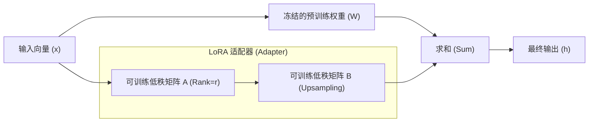

# 全量微调 (Full SFT) vs. LoRA 深度对比

在 2026 年的大模型工程化实践中，开发者不再仅仅纠结于“显存是否足够”，而是深入探讨**知识注入深度**与**收敛稳定性**。本笔记将从底层物理架构到 2026 年的最新变体进行全面解析。

---

## 1. 概念澄清：阶段 vs. 技术

在深入技术细节前，必须厘清 SFT 与 LoRA 的范式关系，防止维度混淆：

*   **SFT (Supervised Fine-Tuning, 有监督微调)**：这是一个**训练阶段或范式**。
    *   它指的是在预训练（Pre-training）之后，使用“指令-回答”对（Prompt-Completion）进行的有监督训练，旨在让模型学会遵循人类指令。
*   **LoRA (Low-Rank Adaptation, 低秩自适应)**：这是一个**具体的微调技术或工具**。
    *   它是 PEFT（参数高效微调）家族中最成功的一员。
*   **关系总结**：你可以通过“全参数微调”来实现 SFT，也可以通过“LoRA 技术”来实现 SFT。

---

## 2. 核心架构：整容手术 vs. 外部支架

### 2.1 全量微调 (Full-parameter Fine-tuning, FFT)
- **底层原理**：更新模型的所有权重矩阵 ($W_{new} = W_{old} + \Delta W$)。梯度在所有层中反向传播并存储所有优化器状态。
- **硬件隐喻**：给模型做一次全身性的**“整容手术”**。每一个神经元和突触（参数）都被重新塑造。
- **价值**：能够深刻改变模型的底层表示和逻辑推理能力，适合重塑基础认知。

### 2.2 LoRA (Low-Rank Adaptation)
- **底层原理**：冻结原始权重 $W_{old}$，引入两个极小的低秩矩阵 $A$ 和 $B$。
- **数学本质**：$\Delta W = A \times B$。由于 $A$ 和 $B$ 的秩（Rank）远小于原始矩阵，参数量被压缩了几个数量级。
- **硬件隐喻**：给模型挂载了一个**“外部支架”**或**“专业翻译插件”**。原始大脑不动，通过支架对输入输出进行转换。
- **价值**：极高的显存效率，能极好地保留模型的基座能力（不至于变傻）。

### 2.3 LoRA 数学逻辑可视化 (Mermaid)

---

## 3. 2026 技术规格深度对比

| 特性 | 全量微调 (FFT) | LoRA / QLoRA | 2026 进阶技术 (DoRA / GaLore) |
| :--- | :--- | :--- | :--- |
| **可训练参数量** | 100% | 0.01% - 1% | 1% - 10% (动态投影) |
| **知识注入深度** | **极深**。适合注入全新的领域事实。 | **较浅**。擅长模仿风格、语气和指令格式。 | **深**。接近 FFT 的拟合能力。 |
| **显存消耗** | **极高** (7B 需 80GB+)。 | **极低** (13B 仅需 24GB)。 | **中等** (24GB 可跑全参数逻辑)。 |
| **收敛速度** | 快（高质量数据下）。 | 中等。存在更新方向耦合问题。 | **快**。DoRA 实现了方向与幅度解耦。 |
| **灾难性遗忘** | **高风险**。容易丢失预训练通用知识。 | **低风险**。原始权重被锁定。 | 中等。通过正交约束实现知识保护。 |

---

## 4. 2026 新兴技术：打破“鱼与熊掌”的困境

2026 年，开发者不再需要在“昂贵的 FFT”和“浅层的 LoRA”之间二选一：

### 4.1 DoRA (Weight-Decomposed Low-Rank Adaptation)
- **突破点**：将权重更新分解为**大小 (Magnitude)** 和 **方向 (Direction)**。
- **实战意义**：解决了传统 LoRA 更新方向受限的问题，使其在处理数学、逻辑推理等高难度任务时表现对齐全量微调。

### 4.2 GaLore (Gradient Low-Rank Projection)
- **突破点**：不改变模型权重，而是将**梯度矩阵**投影到低秩空间。
- **实战意义**：允许在消费级显卡（RTX 4090）上进行**全参数逻辑更新**。如果你需要注入深度事实知识但预算有限，GaLore 是首选。

### 4.3 BAdam (Block-wise Adam)
- **突破点**：采用块坐标下降，每次只更新模型的一个“层块”。
- **实战意义**：在超大规模模型（如 70B）微调中，实现了显存需求降低 60% 且不损失收敛精度。

---

## 5. 连续学习与灾难性遗忘 (2026 研究重点)

连续微调（任务 A -> 任务 B -> 任务 C）是 2026 年的新常态。
- **FFT 的困境**：随着任务 B 的加入，任务 A 的权重会被剧烈改写，产生不可逆的遗忘。
- **LoRA 的优势**：可以保存多个 **Adapter 集合**。每个 Adapter 只负责一个任务，推理时按需加载。
- **新技术 - SSSU (Source-Shielded Updates)**：通过锁定对源任务关键的参数列，实现单模型增量微调而几乎零遗忘。

---

## 6. 2026 工业界决策矩阵

| 你的需求场景 | 推荐路径 | 关键配置建议 |
| :--- | :--- | :--- |
| **改变回复风格/添加话术** | **LoRA** | `r=8`, `alpha=16`, 低学习率 |
| **复杂的逻辑推理/代码生成** | **DoRA** | `r=64`, `alpha=128`, 覆盖 all-linear |
| **垂直领域深度事实注入** | **GaLore / FFT** | 使用 BAdam 优化器, 混合 10% 原始数据 |
| **显存极度紧缺 (12GB/16GB)** | **Unsloth + QLoRA** | 使用 4-bit 量化加载, 极大提升吞吐量 |
| **多任务接力微调** | **O-LoRA** | 强制新旧 Adapter 权重正交 (Orthogonal) |

---

## 7. 针对“训练集 75% 准确率”的架构级复盘

如果你正在面临 75% 的准确率瓶颈，请按照本指南进行深度对齐：

1.  **检查 Loss 计算掩码 (Loss Masking)**：确认你是否只对 Response 计算了 Loss。如果对全量 Prompt 计算 Loss，模型会分散精力去“背题目”而不是“学逻辑”。
2.  **检查 LoRA 覆盖面**：如果你只训练了 `q_proj` 和 `v_proj`，模型在 7000 条数据面前会感到吃力。建议覆盖 `all-linear`（包括 gate_proj, up_proj, down_proj）。
3.  **比例参数**：确认 `alpha` 的设置。通常 `alpha = 2 * r` 是最稳定的比例。
4.  **数据冲突检查**：75% 往往意味着数据集中存在“一问多答且逻辑相左”的样本，干扰了收敛。

## 参考链接
- [DoRA Paper: Weight-Decomposed LoRA](https://arxiv.org/abs/2402.09353)
- [GaLore Paper: Gradient Low-Rank Projection](https://arxiv.org/abs/2403.03507)
- [LoRA Original Paper](https://arxiv.org/abs/2106.09685)

## Update History
- 2026-05-13: 初次创建。
- 2026-05-13: **深度全量扩充**：加入 FFT vs LoRA 底层架构对比、2026 新兴技术（DoRA/GaLore/BAdam）解析。
- 2026-05-13: **内容补完与纠偏**：根据详尽性准则，恢复 SFT 与 LoRA 的范式辨析，重新插入 Mermaid 数学逻辑图，确保基础与前沿知识无缝衔接。
