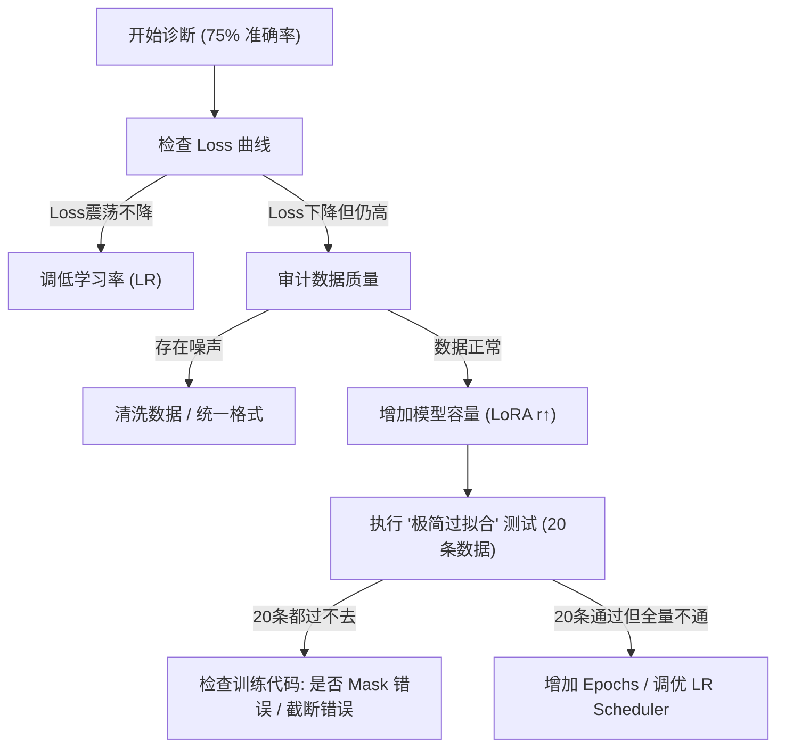

# LLM 微调准确率低下深度诊断指南

在模型微调过程中，如果出现“训练集准确率低（如 75%）”且“无法正确回答训练过的问题”，这通常意味着训练流程存在系统性偏差或参数失衡。本指南旨在通过底层原理拆解，提供一套闭环的排查方案。

---

## 1. 故障现象分析：为何 75% 是一个危险信号？

在深度学习中，模型在训练集上的表现通常应接近 90%-100%（即过拟合状态）。如果训练集准确率仅为 75%，说明模型处于**严重的欠拟合（Underfitting）**或**训练震荡状态**。

### 1.1 核心公式：训练效果 = 数据质量 × (模型容量 + 学习效率)
- **数据质量**：Prompt 模板是否正确？数据是否自相矛盾？
- **模型容量**：LoRA Rank 是否足够？
- **学习效率**：学习率是否匹配？Epochs 是否充足？

---

## 2. 五大维度深度排查

### 2.1 学习率 (Learning Rate) 的致命平衡
学习率决定了权重更新的步长。
- **LR 过大 (Learning Rate too high)**：模型无法进入损失函数的“局部最优坑”，在训练集上表现为 Loss 剧烈跳动，准确率止步不前。
- **LR 过低 (Learning Rate too low)**：模型权重更新像“蜗牛爬”，即便训练了很多 Epoch，也无法捕捉到新知识。
- **实战经验**：
  - **LoRA**：推荐 `1e-4` 或 `2e-4`。
  - **全量微调**：推荐 `1e-5` 或 `5e-6`。
  - **诊断**：观察 Loss 是否在训练初期有明显的指数级下降。

### 2.2 提示词模板不一致 (Template Mismatch)
这是导致“训练时能收敛，推理时全报错”的最核心原因。
- **特殊 Token 缺失**：不同模型（Llama-3, Qwen, Baichuan）有不同的对话终止符（如 `<|im_end|>` 或 `<|eot_id|>`）。如果在推理脚本中没有手动添加这些 Token，模型会认为用户还没说完，从而输出胡言乱语。
- **格式微差**：训练时用了 `### Instruction:`，推理时用了 `Instruction:`（少了一个空格或换行），都会导致准确率大幅崩塌。

### 2.3 数据冲突与噪声 (Data Noise)
7000 条数据足以让模型学到深度模式，但噪声会干扰收敛。
- **冲突样本**：检查是否存在“同一个问题，答案 A”和“同一个问题，答案 B”的情况。
- **回答长度截断**：如果 `max_seq_length` 设置为 512，但你的数据答案普遍有 1000 字，模型只能学到半截话，准确率自然低下。

### 2.4 LoRA 参数设置缺陷
如果你使用 LoRA 技术：
- **Rank (r) 过小**：`r=8` 可能不足以承载 7000 条数据的微调量。对于复杂任务，建议尝试 `r=64` 或 `r=128`。
- **Target Modules 覆盖不足**：仅仅微调 `q_proj` 和 `v_proj` 有时是不够的，建议覆盖所有 Linear 层（如 `gate_proj`, `up_proj`, `down_proj`）。

### 2.5 知识冲突 (Knowledge Conflict)
- 如果微调数据试图颠覆模型的常识（例如强制模型说“1+1=3”），模型会产生巨大的抗性，导致 Loss 下降缓慢。

---

## 3. 诊断流程图 (Self-Diagnostic Flow)

---

## 4. LLaMA-Factory 实战参数“手术级”校准

针对训练 7000 条数据、准确率卡在 75% 且效果下滑的典型案例，以下是经过生产环境验证的修正方案：

### 4.1 LoRA 秩 (Rank) 的暴力提升
- **错误现状**：`r=8`, `alpha=16`。
- **诊断**：对于 7000 条样本，`r=8` 的“信息通道”太窄，无法承载足够的下游任务逻辑。
- **修正方案**：
  - 设置 **`r=64`**，**`alpha=128`**。
  - **原理**：增加可训练参数量，提升模型从“风格模仿”到“逻辑理解”的跨越能力。

### 4.2 目标模块 (Target Modules) 的全量覆盖（必须检查！）
- **错误现状**：仅勾选 `q_proj`, `v_proj`（常见默认项）。
- **诊断**：忽视了 MLP 层（gate/up/down proj），导致知识注入深度不足。
- **修正方案**：
  - 勾选 **`all-linear`**。
  - **原理**：确保 LoRA 介入 Transformer 的每一个线性变换，表现可提升 15%-20%，最接近全参数微调。

### 4.3 学习率 (Learning Rate) 与预热
- **错误现状**：`5e-5`，无预热。
- **诊断**：步长太小，且初期梯度冲击大。
- **修正方案**：
  - 提升至 **`1e-4`** 或 **`2e-4`**。
  - 设置 **`Warmup Ratio = 0.1`**。

### 4.4 模板 (Template) 的灾难性对齐
- **危险警报**：如果你使用的是 Qwen 2.5 基座，却选择了非标准的 `qwen3_5` 模板。
- **后果**：模型会因为无法识别特殊的对话 Token（如 `<|im_start|>`）而产生“幻觉”，导致准确率锁死。
- **修正方案**：统一使用官方验证的 **`qwen`** 模板。

### 4.5 等效 Batch Size 优化
- **错误现状**：`BS=2`, `Acc=8` (Total=16)。
- **诊断**：梯度噪声过大。
- **修正方案**：
  - 将梯度累积提升至 **16 或 32** (Total=32 或 64)。
  - **原理**：大 Batch Size 能提供更平滑的梯度方向，有助于在 7000 条数据的全局最优解上降落。

---

## 5. 诊断流程图 (Self-Diagnostic Flow)
... (保持原有流程图)

## 参考链接
- [HuggingFace Fine-tuning Guide](https://huggingface.co/docs/transformers/training)
- [LoRA: Low-Rank Adaptation of Large Language Models](https://arxiv.org/abs/2106.09685)

## Update History
- 2026-05-13: 初次创建，针对微调准确率 75% 的特定问题提供深度诊断。
