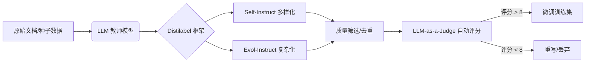

# 微调语料自动化生成：技术方案与工具链

在微调数字人或特定领域 LLM 时，高质量训练数据的获取是最大瓶颈。利用大模型生成高质量“合成数据（Synthetic Data）”已成为主流技术路径。以下是三种核心技术方案及其工作流。

## 1. Self-Instruct：自举式指令扩展
**适用场景**：已知少量种子任务（Seed Tasks），需要快速扩展出数万条类似但多样的指令。

### 工作流
1.  **种子库准备**：准备约 100-200 条人工编写的高质量指令（Instruction）和实例。
2.  **指令生成**：利用强模型（如 GPT-4, DeepSeek-V3）通过 Few-shot 方式，基于种子任务生成新的指令。
3.  **任务分类**：自动识别生成的指令是分类任务还是开放回答，采用不同的实例生成策略。
4.  **实例填充**：为新指令生成对应的 Input 和 Output。
5.  **多样性过滤**：使用 ROUGE-L 等指标计算相似度，剔除冗余和低质量数据。

---

## 2. Evol-Instruct：演进式复杂度提升
**适用场景**：生成的语料过于简单（如“你好”、“请介绍展厅”），需要提升模型处理复杂逻辑和多约束任务的能力。

### 演进策略
-   **深度演进 (In-depth)**：增加约束条件、深化背景信息、增加推理步骤、将具体概念抽象化。
    -   *示例*：“介绍这个展项” -> “以 5 岁小孩能听懂的语气，对比这两个展项的异同点，并加入一个趣味互动点”。
-   **广度演进 (In-breadth)**：基于原指令生成语义相关但领域不同的新指令，增加覆盖面。

---

## 3. RAG-to-Dataset：基于文档的精准转化
**适用场景**：针对展厅场景，将现有的 PDF、Word 技术文档自动转化为微调所需的 ASR/TTS 风格对。

### 推荐工具链：Distilabel (by Argilla)
1.  **文档分块 (Chunking)**：将展厅文档按语义分割。
2.  **QA 生成**：利用 LLM 针对每个文本块生成“访客可能会问的问题”。
3.  **多风格改写**：将标准答案改写为“口语化”、“专业解说”、“简短回复”等多种风格，形成多轮对话数据。
4.  **负样本构建**：生成看似相关但错误的答案，用于 DPO（直接偏好优化）训练，提升模型的抗幻觉能力。

---

## 4. 专项工具方案：RAGAS vs. Easy-Dataset

在实际操作中，除了通用的框架，还有两个专门针对数据集生成的流行方案：**RAGAS** 和 **Easy-Dataset**。

### 4.1 RAGAS (评估导向型)
**定位**：RAG 性能评估的标准框架，其 Testset Generation 功能旨在为 RAG 系统生成“压力测试”题。

- **核心机制**：**进化生成范式 (Evolutionary Generation)**。它不是简单生成 Q&A，而是通过 LLM 对初始问题进行改写，增加“推理步骤”、“多文档依赖”或“特定条件限制”。
- **评价指标**：提供 Faithfulness（忠实性）、Relevancy（相关性）等指标，帮助开发者量化 RAG 的效果。
- **优点**：业界认可度高，生成的测试集具有极高的挑战性和区分度。
- **缺点**：主要面向开发者，需通过 SDK 调用，缺乏可视化管理界面。

### 4.2 Easy-Dataset (生产导向型)
**定位**：由北航团队开源的全流程数据集构建平台，侧重于降低数据生产门槛。

- **核心机制**：**角色驱动生成**。支持从不同角度（如专家、初学者、反对者）理解同一份材料，从而生成多样化的指令。
- **功能特色**：
    - **可视化分块**：支持 PDF、Word、EPUB 等多格式的智能解析与可视化切分。
    - **思维链 (CoT) 生成**：自动为每个答案生成逻辑推导过程。
    - **数据清洗**：内置降噪功能，去除文档解析过程中的乱码和无关信息。
- **优点**：提供 Web 界面，开箱即用，适合非技术人员构建领域知识库。
- **缺点**：生成深度受限于背后的 LLM，在大规模自动化流水线中灵活性略逊于 SDK。

### 4.3 优缺点对比与选择建议

| 需求场景 | 推荐方案 | 理由 |
| :--- | :--- | :--- |
| **验证 RAG 系统的准确率** | **RAGAS** | 提供专业的评估指标和具有挑战性的测试集。 |
| **从 0 构建展厅微调数据集** | **Easy-Dataset** | 支持多种文档格式，可视化操作，生产效率高。 |
| **构建逻辑推理/复杂指令集** | **Evol-Instruct** | 专攻指令的深度和复杂度。 |
| **构建大规模、低成本流水线** | **Distilabel** | 灵活性最强，适合集成到 CI/CD 中。 |

---

## 5. 自动化流水线架构图 (Mermaid)

---

## 5. 核心工具推荐

| 工具名称 | 开发者 | 核心能力 |
| :--- | :--- | :--- |
| **Distilabel** | Argilla | 目前最完整的合成数据流水线，支持 DPO 数据生成。 |
| **Unsloth** | Unsloth AI | 提供极速微调的同时，集成了简单的合成数据生成脚本。 |
| **Self-Instruct** | 华盛顿大学 | 开源的经典自举框架。 |
| **DeepSeek-R1 (Distill)** | DeepSeek | 极佳的“教师模型”，通过其生成的 CoT 数据极具价值。 |

## 建议行动点
1.  **第一步**：收集展厅现有的讲解词文档，使用 **Distilabel** 的 `TextGeneration` 任务批量生成 Q&A 对。
2.  **第二步**：使用 **DeepSeek-R1** 对生成的答案进行思维链（CoT）增强，提升数字人的逻辑解释能力。
3.  **第三步**：将生成的语料通过 `LLM-as-a-Judge` 机制（如使用 GPT-4o 评分）进行清洗，保留高质量语料用于最终微调。

## 参考链接
- [[LLM微调技术详解]]
- [Distilabel Documentation](https://distilabel.argilla.io/)
- [Evol-Instruct: WizardLM Research](https://github.com/nlpxucan/WizardLM)

## Update History
- 2026-02-08: 初次创建，总结合成数据生成方案。
