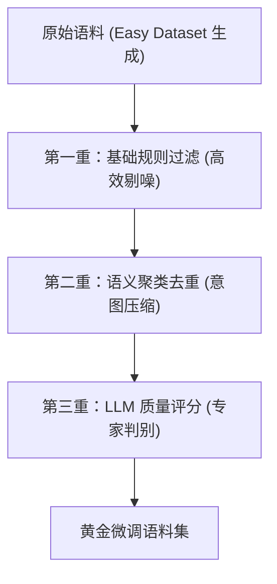

# 微调语料质量控制实战指南

对于医疗诊断（如糖尿病诊断指南）这类对**准确性**和**专业性**要求极高的微调任务，语料的质量直接决定了模型的上线表现。本指南提供了一套成熟的“三重过滤门禁”方案，并针对医学指南场景提供了专项优化逻辑。

---

## 1. 方案核心架构：三重过滤门禁

我们要解决的核心痛点是：**剔除垃圾数据（噪声）、合并近似意图（去重）、保障专业逻辑（评分）。**



---

## 2. 第一重：基础规则过滤 (Rule-based Cleaning)

利用正则表达式和基础统计，快速剔除 30% 以上的无效数据。

### 2.1 过滤目标
- 字数太少的短句（无法构成完整指令）。
- 包含“根据上述文本”、“请回答”等生成器残留的废话。
- 缺失关键医学术语（如血糖、胰岛素等）的问题。

### 2.2 Python 实现逻辑
```python
import pandas as pd
import re

def basic_clean(df):
    # 1. 剔除过短的问题或回答
    df = df[df['instruction'].str.len() > 5]
    df = df[df['output'].str.len() > 10]
    
    # 2. 剔除生成器常见的冗余引导语
    noise_patterns = [
        r"^根据提供的文本.*",
        r"^请根据下述内容.*",
        r"点击查看更多.*"
    ]
    for pattern in noise_patterns:
        df['instruction'] = df['instruction'].apply(lambda x: re.sub(pattern, "", x).strip())
        
    # 3. 医疗关键词强制存在检查
    medical_keywords = ["血糖", "诊断", "标准", "糖尿病", "指标", "mmol/L", "glucose", "diagnosis"]
    df = df[df['instruction'].apply(lambda x: any(k.lower() in x.lower() for k in medical_keywords))]
    
    return df
```

---

## 3. 第二重：语义聚类去重 (Semantic Deduplication)

针对“意思近似”的问题，使用 Embedding（词向量）计算相似度，只保留逻辑最严密的一条。

### 3.1 算法逻辑
1.  将所有 `instruction` 转化为向量。
2.  计算两两之间的余弦相似度。
3.  通过阈值（如 0.92）建立连通分量，在相似组内只保留最长的 Answer 或包含数值最多的样本。

### 3.2 Python 实现逻辑 (基于 Sentence-Transformers)
```python
from sentence_transformers import SentenceTransformer, util
import torch

def semantic_dedup(df, threshold=0.92):
    model = SentenceTransformer('BAAI/bge-m3') # 2026年主流多语言模型
    instructions = df['instruction'].tolist()
    embeddings = model.encode(instructions, convert_to_tensor=True)
    
    # 计算余弦相似度矩阵
    cosine_scores = util.cos_sim(embeddings, embeddings)
    
    to_remove = set()
    for i in range(len(instructions)):
        if i in to_remove: continue
        for j in range(i + 1, len(instructions)):
            if cosine_scores[i][j] > threshold:
                # 策略：保留更长的答案
                if len(df.iloc[i]['output']) >= len(df.iloc[j]['output']):
                    to_remove.add(j)
                else:
                    to_remove.add(i)
                    break
                    
    return df.drop(df.index[list(to_remove)])
```

---

## 4. 第三重：LLM 质量评估评分 (LLM-as-a-Judge)

使用更强大的模型（如 DeepSeek-V4）对剩余语料进行“专家级”打分。

### 4.1 评分标准 Prompt 示例
> 你是一位严谨的糖尿病诊断专家。请根据《糖尿病诊断指南》对以下 QA 对进行评分（1-5分）。
> 5分：医学逻辑完全正确，包含精准数值，无废话。
> 3分：逻辑大致正确，但表述模糊或缺少核心指标。
> 1分：内容错误、断章取义或完全无关。
> 请仅输出分数：数字。

---

## 5. 特定场景：医学指南类语料清洗专项

医学指南（如糖尿病指南）生成的语料通常具有“元数据多”、“双语混杂”、“数值敏感”等特点。针对这些特征，需要执行以下专项清洗策略。

### 5.1 元数据与参考文献噪声治理 (Metadata Scrubbing)
**痛点**：Easy Dataset 类工具常会针对参考文献的作者、DOI、期刊名生成大量无效问题。
**策略**：建立针对出版信息的黑名单正则过滤。

#### Python 实现逻辑：
```python
def remove_metadata_noise(df):
    # 定义元数据关键词黑名单
    metadata_patterns = [
        r"Who are the authors", r"In which journal", r"DOI:", r"published in", 
        r"study by", r"et al\.", r"ISSN", r"published year", r"发表于", 
        r"参考文献", r"期刊", r"作者是", r"DOI号"
    ]
    pattern = "|".join(metadata_patterns)
    
    # 过滤掉包含黑名单关键词的问题
    initial_count = len(df)
    df = df[~df['instruction'].str.contains(pattern, case=False, na=False)]
    print(f"已剔除元数据噪声: {initial_count - len(df)} 条")
    return df
```

### 5.2 中英双语共存与术语平衡
**策略**：**不进行语言过滤**，但需确保术语（Terminology）与临床逻辑（Clinical Logic）的配比平衡。
- **术语类问题**：如 "What does PPAR stand for?" 或 "PPAR的中文全称是什么?"。
- **权重控制**：如果此类基础定义问题过多（超过 20%），应进行随机下采样，将模型的拟合能力留给更复杂的临床路径（如“二甲双胍的减量指征”）。

### 5.3 数值敏感型分层去重 (Numerical-Aware Dedup)
**痛点**：医学指南中，意思相近的问题可能因为一个微小的数值差异（如 7.0 vs 7.1）而变成完全不同的医学含义。普通的语义去重可能误杀。
**策略**：在计算相似度前，先提取问题和答案中的核心数值，作为**“强哈希”**。

#### Python 增强逻辑：
```python
def medical_dedup_with_numbers(df, threshold=0.95):
    # 提取文本中所有的数字（包含小数点）
    def extract_numbers(text):
        return set(re.findall(r"\d+\.?\d*", text))

    df['numbers'] = df['instruction'].apply(extract_numbers)
    
    # 只有当两个问题的核心数值集合完全一致时，才考虑进行语义去重
    # ... (在 semantic_dedup 逻辑中加入此判断)
    # if cosine_scores[i][j] > threshold and df.iloc[i]['numbers'] == df.iloc[j]['numbers']:
    #     to_remove.add(j)
```

### 5.4 逻辑自洽性深度校验
对于医学语料，Answer 必须包含推理过程。
- **校验逻辑**：检查 Answer 中是否包含逻辑连接词（如“因为”、“由于”、“导致”、“因此” / "due to", "result in", "therefore"）。
- **处理**：缺失逻辑连接词的简单陈述句 QA 应降低评分权重。

---

## 6. 医疗语料特有的质量红线 (Checklist)

1.  **数值绝对对齐**：空腹血糖 $\ge 7.0$ mmol/L 是红线，必须通过正则脚本二次校验 Answer 中的关键数值。
2.  **单位一致性**：统一 `mmol/L`，识别并修正 `mg/dL`。
3.  **负样本保留**：保留如“以下哪项不属于 1 型糖尿病的特征？”这类判别式问题，增强模型的鉴别诊断能力。

## 参考链接
- [[微调语料自动化生成技术方案]]
- [[System-Prompt-在-SFT-中的深度影响]]
- [Sentence-Transformers: Multilingual Embedding](https://www.sbert.net/)

## Update History
- 2026-05-13: 初次创建。
- 2026-05-13: **医学专项增强**：新增“医学指南类语料清洗专项”章节，涵盖元数据噪声治理、双语平衡及数值敏感型去重策略。
