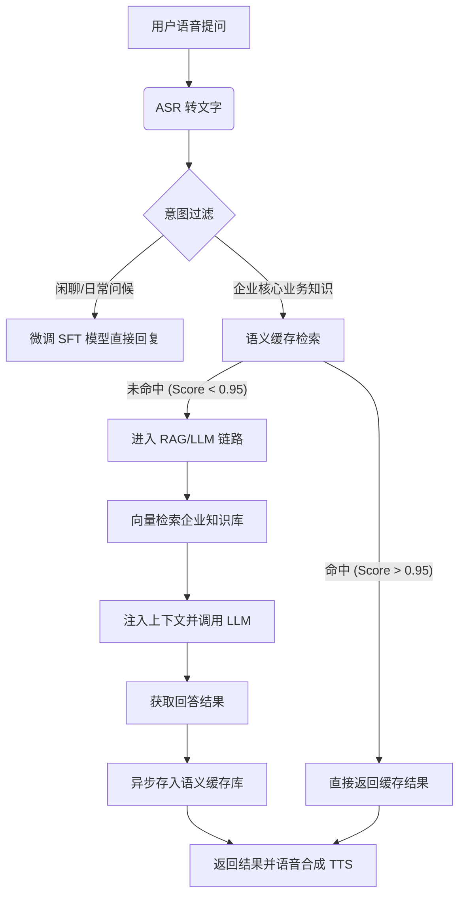

# 语义缓存 (Semantic Cache) 与大模型配合方案

单纯的“命中/未命中”只是基础。要让语义缓存真正成为企业助手的“极速大脑”，需要在大模型流水线中进行深度的逻辑编排。

## 1. 业务流水线集成 (Pipeline Integration)

在数字人场景下，建议的完整流水线如下：

## 2. 深度配合的四个核心细节

### 2.1 保持风格一致性 (Persona Consistency)
*   **痛点**：如果缓存是人工写的，而 LLM 是微调过的，数字人的说话风格会瞬间切换（比如从“热情”变“冷淡”），导致访客感到违和。
*   **对策**：
    *   **SFT 生成**：在“预热”缓存时，必须调用微调后的 **SFT 模型** 来生成标准答案，并由人工进行微调修正。
    *   **Style Check**：存入缓存前，检查回答是否包含公司特定的欢迎语或结尾词。

### 2.2 处理对话上下文 (Context-Aware Caching)
*   **痛点**：如果用户连续提问：“公司在哪里？” -> “怎么去？”。简单的语义缓存会把所有人的“怎么去”都当成同一个问题。
*   **对策**：
    *   **复合 Key**：在计算 Embedding 时，将**当前问题 + 意图分类 + 前一轮的关键词**组合在一起。
    *   *示例 Key*：`Embedding("前文：公司地点 | 当前：怎么去")`。这样缓存就能区分“怎么去公司”和“怎么去展馆”。

### 2.3 缓存与 RAG 的动态反馈 (Auto-Learning)
*   **机制**：当缓存未命中（Cache Miss）且 LLM 通过 RAG 给出了一个高质量回答时，应自动将其“转正”进缓存。
*   **过滤规则**：只有当 LLM 回答的 **Confidence Score** 较高，且引用了明确的企业文档时，才存入缓存。这能让缓存库随着使用量的增加变得越来越强大。

### 2.4 知识失效管理 (Dynamic Invalidation)
*   **场景**：公司领导人更替或办公地址搬迁。
*   **实现方案**：
    *   **标签化存储**：每条缓存数据打上来源标签（如 `tag: "company_info"`）。
    *   **事件驱动更新**：当企业管理后台更新了某份 PDF 文档，系统发出 Webhook，根据标签自动清理语义缓存库中相关的向量条目。

## 3. 落地建议：分级缓存策略

| 级别 | 内容 | 响应延迟 | 命中策略 |
| :--- | :--- | :--- | :--- |
| **L1: 专家精选 (Verified)** | 企业最核心、最敏感的介绍（如愿景、财报、地址）。 | **10-30ms** | 只要语义相似度 > 0.92 立即命中。 |
| **L2: 历史高频 (Auto)** | 过去 30 天访客常问且 LLM 回答正确的知识。 | **30-50ms** | 需相似度 > 0.96 方可命中，确保安全。 |
| **L3: 实时推理 (RAG)** | 长尾问题、动态变化的最新动态。 | **1-3s** | 回退到 RAG + LLM 链路。 |

## 总结
**“微调是灵魂（说话好听），语义缓存是肌肉记忆（反应极快），RAG 是知识储备（防止胡说）。”** 三者配合，才能打造出一个既聪明又敏捷的企业助手。

## Update History
- 2026-04-10: 初次创建，解析语义缓存与 LLM、RAG 的深度协同方案。

## Related
- [[语义缓存-Semantic-Cache-实现指南]]
- [[企业内部助手微调方案]]
- [[数字人展厅语音交互：RAG对比微调技术方案分析]]
