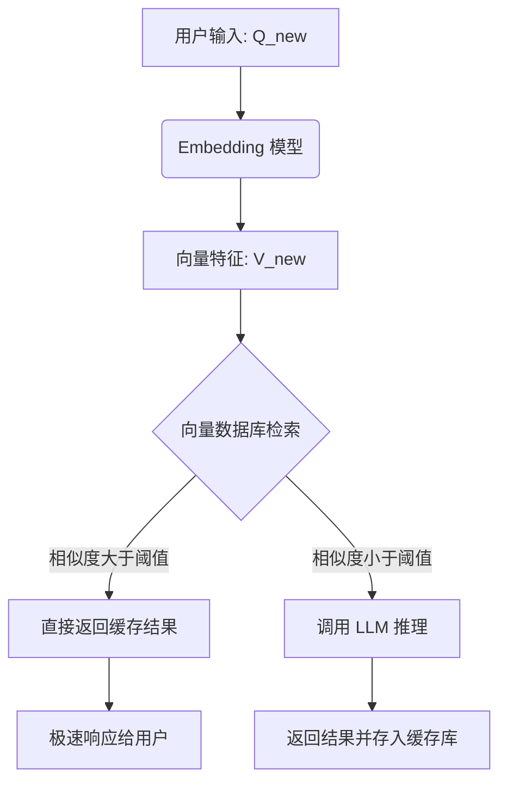

# 语义缓存 (Semantic Cache) 实现指南

语义缓存（Semantic Cache）是解决 LLM 响应慢、成本高的“银弹”。与传统的 Key-Value 缓存（完全匹配）不同，它通过**向量相似度**判断用户意图是否已在缓存中。

## 1. 核心架构与工作流



## 2. 关键组件选型

| 组件 | 推荐方案 | 说明 |
| :--- | :--- | :--- |
| **Embedding 模型** | `text-embedding-3-small` (OpenAI) 或 `bge-large-zh` (本地) | 必须保证缓存写入和查询使用**同一个**模型。 |
| **向量数据库** | **Redis (Search & Query)** / **Milvus** / **FAISS** (单机) | 推荐使用 Redis，因为它支持内存加速且具备向量搜索功能。 |
| **应用框架** | **GPTCache** (专门的缓存库) 或 **LangChain** | 封装了复杂的相似度计算逻辑。 |

## 3. Python 核心实现逻辑 (伪代码)

以下展示了一个使用 `FAISS` 实现的基础语义缓存逻辑：

```python
import numpy as np
import faiss
from sentence_transformers import SentenceTransformer

# 1. 初始化
model = SentenceTransformer('bge-small-zh') # 本地 Embedding
dimension = 512 # 向量维度
index = faiss.IndexFlatIP(dimension) # 使用内积(相似度)搜索
cache_data = [] # 存储对应的文本答案
SIMILARITY_THRESHOLD = 0.92 # 相似度阈值

def get_answer(user_query):
    # 2. 向量化用户查询
    query_vector = model.encode([user_query])
    faiss.normalize_vectors(query_vector) # 归一化以计算余弦相似度
    
    # 3. 检索缓存
    # k=1 表示找最相似的一条
    distances, indices = index.search(query_vector, k=1)
    
    # 4. 判断命中
    if len(indices) > 0 and distances[0][0] > SIMILARITY_THRESHOLD:
        print(">>> [Cache Hit] 语义命中！")
        return cache_data[indices[0][0]]
    
    # 5. 缓存未命中，调用大模型
    print(">>> [Cache Miss] 调用 LLM...")
    answer = call_llm(user_query) # 假设的 LLM 调用函数
    
    # 6. 写入缓存库
    index.add(query_vector)
    cache_data.append(answer)
    
    return answer
```

## 4. 落地关键细节 (避坑指南)

### 4.1 阈值 (Threshold) 的调优
*   **设置过高 (如 0.98)**：导致“问法稍变”就无法命中，缓存利用率低。
*   **设置过低 (如 0.85)**：导致“张冠李戴”。比如问“公司地址”命中了“公司电话”的回答。
*   **建议**：起步设置 **0.92 - 0.95**，根据实际业务反馈动态调整。

### 4.2 缓存的一致性与过期
*   **场景**：如果公司 CEO 换了，缓存里的“公司领导是谁”必须失效。
*   **方案**：
    *   **定时刷新**：Redis 设置 TTL。
    *   **手动清除**：在后台管理系统中，每当更新企业文档，自动清空对应的向量缓存。

### 4.3 意图分类 (Intent Pre-filter)
*   **建议**：在进入语义缓存前，先做简单的意图识别。
    *   如果用户在“闲聊”，不查缓存。
    *   如果用户在询问“企业核心知识”，必查缓存。

## 5. 快速启动与维护策略 (数字人落地路线图)

对于数字人场景，为了实现上线即“秒回”，建议采用以下三步走策略：

### 5.1 冷启动：大模型辅助生成 (LLM-Aided Generation)
不要人工去写所有的 QA 对。
*   **做法**：将企业文档喂给 GPT-4/Claude，让其站在访客角度生成 **50-100 个核心高频问题** 及其标准答案。
*   **目的**：确保数字人在上线第一天就能对最常见的问题（如“公司是谁”、“在哪”、“卖什么”）做出极速响应。

### 5.2 热更新：异步自动入库 (Auto-Evolution)
系统应具备“边跑边学”的能力。
*   **做法**：当发生 **Cache Miss** 时，大模型生成答案后，系统**异步**将该“新问题向量 + 答案”存入缓存库。
*   **目的**：随着访客增加，缓存库会自动覆盖长尾问题，响应速度会越来越快。

### 5.3 定期审计：人工裁剪 (Manual Pruning)
防止“幻觉”被固化到缓存中。
*   **做法**：每周导出一次缓存库，人工删除那些回答质量不高的条目，保留最完美的回答。

## 6. 推荐工具：GPTCache

**GPTCache** 是目前该领域最成熟的开源方案，支持：
*   多种 Embedding 模型。
*   多种存储后端（Redis, MySQL, PostgreSQL）。
*   自定义评估机制。

**GitHub**: `https://github.com/zilliztech/GPTCache`

## Update History
- 2026-04-10: 补充冷启动（大模型辅助生成）与热更新（异步入库）的落地策略。
- 2026-04-10: 初次创建，提供语义缓存架构图、核心代码示例及落地细节。

## Related
- [[语义缓存-Semantic-Cache-与-LLM-配合方案]]
- [[RAG-vs-Semantic-Cache-深度对比]]
- [[数字人展厅语音交互：RAG对比微调技术方案分析]]
