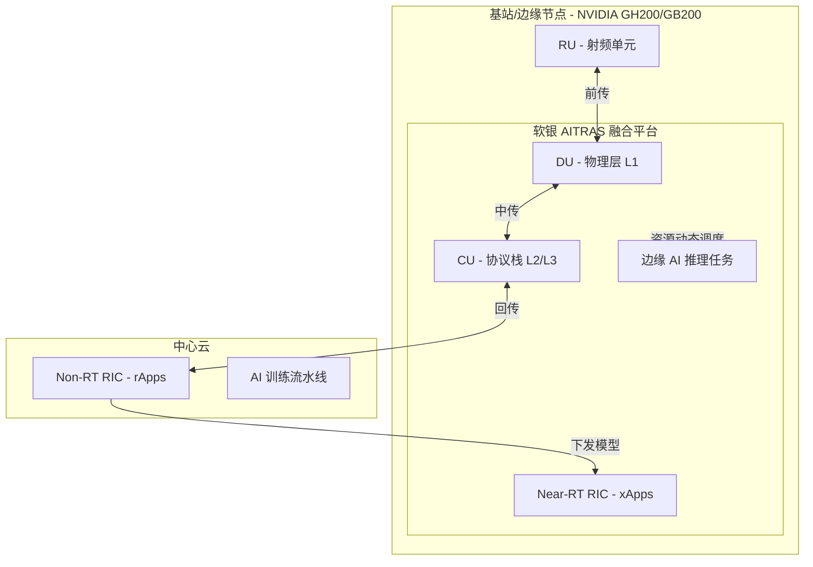

# AI-RAN 技术全景指南

AI-RAN（Artificial Intelligence - Radio Access Network）是一种将人工智能深度集成到无线接入网（RAN）硬件和软件中的技术范式。它代表了无线通信网络从基于专用硬件（ASIC/SoC）的单一通信平台，向基于通用加速计算（如 GPU）的**多用途智能平台**的重大转型。

## 1. 核心定义与本质变革

AI-RAN 不仅仅是在现有网络中“加入 AI”，而是从底层重构 RAN：
*   **软件定义**：通过云原生技术（容器、微服务）实现电信负载与 AI 负载的共存。
*   **算力融合**：利用通用加速平台（如 NVIDIA GPU）同时处理传统的无线协议栈（Layer 1/2/3）和 AI 推理/训练任务。

## 2. AI-RAN 的三大价值维度 (The Three Pillars)

AI-RAN 联盟定义了三个互补的维度，共同构成了其商业与技术价值：

### AI for RAN (提升网络效率)
*   **功能**：利用 AI/ML 优化物理层（PHY）和信号处理。
*   **关键技术**：信道估计、波束成形（Beamforming）、资源调度、功率控制。
*   **价值**：提升频谱效率（最高可达 2 倍）、大幅降低基站能耗。

### AI and RAN (共享基础设施)
*   **功能**：在同一套计算资源上并行运行 RAN 和 AI 任务。
*   **关键技术**：GPU 虚拟化、MIG（多实例 GPU）、确定性调度。
*   **价值**：将基站硬件利用率从 ~33% 提升至近 100%，实现“基础设施即服务”（IaaS）。

### AI on RAN (业务价值变现)
*   **功能**：在基站侧（网络边缘）直接托管第三方 AI 应用。
*   **场景**：计算机视觉、自动驾驶协同、XR、数字孪生。
*   **价值**：利用超低延迟特性，直接在边缘提供 AI 服务，创造新收入。

## 3. GPU 在 AI-RAN 中的部署位置

在 AI-RAN 架构中，GPU 并不是随意摆放的，而是根据任务的实时性需求，主要部署在以下两个逻辑单元：

### 3.1 DU (Distributed Unit - 分布式单元) - **核心部署点**
*   **任务类型**：处理 Layer 1 (物理层) 的高密度信号处理。
*   **部署原因**：物理层需要极高的并行计算能力（如 FFT 变换、信道估计）。NVIDIA 的 **Aerial** 5G SDK 就是运行在 DU 的 GPU 上的。
*   **价值**：实现“AI for RAN”，通过 AI 算法实时优化波束成形，直接提升频谱效率。

### 3.2 CU (Centralized Unit - 集中式单元) / Edge Cloud
*   **任务类型**：处理 Layer 2/3 (协议栈) 以及 Near-RT RIC 的 xApps。
*   **部署原因**：CU 负责协议控制逻辑。将 GPU 部署于此，可以运行需要 10ms-100ms 响应时间的 AI 模型，用于动态资源分配。
*   **价值**：实现“AI on RAN”，作为边缘 AI 计算节点，托管低延迟的第三方应用（如工业视觉、AR/VR 渲染）。

### 3.3 物理部署形式：边缘数据中心 (Cell Site / CO)
*   **Small Cell/Macro Site**：在宏基站或小基站侧直接安装配备 GPU 的服务器（如 NVIDIA MGX 架构服务器）。
*   **CO (Central Office)**：在运营商的中心机房集中部署 GPU 资源池，通过 C-RAN 架构远端控制 RU (Radio Unit)。

## 4. 核心利益分析 (Value Proposition)

### 4.1 对运营商 (Operators) 的好处
1.  **TCO 优化**：
    *   **能耗节省**：通过 AI 流量预测实现基站动态关断，降低 ~80% 的网络能耗来源。
    *   **运维自动化 (AIOps)**：预测性维护减少停机时间，降低人工巡检成本。
2.  **收入增长**：
    *   **算力出租**：将基站闲置 GPU 算力出租给企业做 AI 推理（AI-as-a-Service）。
    *   **高价值业务**：提供极低延迟的边缘 AI 专网服务（如智能工厂、车路协同）。
3.  **平滑演进**：为 6G AI 原生网络构建统一的软件定义架构。

### 4.2 对终端用户 (End-Users) 的好处
1.  **极致连接体验**：
    *   **更稳更爽**：在高密度人群（如球场）或高速移动中，AI 实时抗干扰算法确保连接不中断、不掉速。
    *   **按需网络**：云游戏自动分配低延迟，视频会议自动分配高上行。
2.  **移动 AI 赋能**：
    *   **云端算力下沉**：复杂的 AI 任务（如实时翻译、AR 导航）卸载到基站边缘处理，低配手机也能跑大模型。
    *   **更长续航**：计算外包减少了手机芯片的本地负载，显著延长电池寿命。

## 5. 深度实战案例：软银 (SoftBank) AITRAS 架构

软银与 NVIDIA 合作开发的 **AITRAS** 是全球首个真正实现 AI-RAN 融合的商业化架构。

### 5.1 核心架构细节
*   **合作伙伴**：SoftBank（软银）与 NVIDIA。
*   **底层平台**：基于 **NVIDIA AI Aerial**（原 Aerial 5G SDK）开发。
*   **核心硬件**：**NVIDIA GH200 Grace Hopper** 超级芯片（Arm Grace CPU + Hopper GPU）。

### 5.2 2025-2026 试点实测数据 (Effectiveness)
*   **承载能力**：单台服务器成功稳定处理了 **20 个 100MHz 带宽的 5G 小区**，硬件部署密度提升约 **7-20 倍**。
*   **算力调度**：实现了通信任务与 AI 推理任务的“毫秒级切换”。在流量闲时，GPU 资源自动释放给 AI 智能体（如路侧协同感知、大模型推理）。
*   **能效表现**：通过 CU/DU/AI 三合一部署，基站机房**总功耗降低了 30%-40%**。
*   **商业回报**：实测验证了 **1:5 的回报比**（即 1 美元的基站资本支出有望产生 5 美元的 AI 服务收入）。

## 6. 核心组件：RIC (无线智能控制器)

RIC 是实现 AI-RAN 智能化和可编程性的中枢，源自 O-RAN 标准：
*   **Non-RT RIC (非实时 RIC)**：时间尺度 > 1s，负责策略制定、训练 AI 模型、全局优化。运行组件为 **rApps**。
*   **Near-RT RIC (近实时 RIC)**：时间尺度 10ms - 1s，负责执行实时控制（如动态资源分配）。运行组件为 **xApps**（包含 AI 推理引擎）。

## 7. AI-RAN 架构示意图 (Mermaid)

## 8. 行业现状与最新技术动态 (2025-2026)

*   **AI-RAN Alliance**：成员超过 130 家，由 NVIDIA、软银、三星、爱立信等牵头。
*   **ARC-Pro 平台**：NVIDIA 推出的商业化 AI-RAN 平台已进入大规模试点。
*   **Agentic AI**：开始利用大模型（LLM）自动化解释运营商意图并管理网络行为。
*   **硬件演进**：软银已计划从 GH200 迁移至下一代 **Blackwell (GB200)**，预计 AI 能力提升 5 倍。

## 9. 学习路径建议
1.  **基础**：学习无线通信基础（5G 架构、OFDM 等）。
2.  **框架**：深入研究 O-RAN 联盟的 RIC 规范。
3.  **工具**：了解 NVIDIA Aerial 软件库（用于 GPU 加速 RAN）。
4.  **前沿**：关注 [[DeepSeek-R1深度解析]] 中提到的推理模型在网络自愈中的应用。

## 10. 通感一体化 (ISAC) 与 AI-RAN 的协同

AI-RAN 的高性能计算能力为 **[[通感一体化-ISAC技术全景指南]]** 提供了理想的落地平台：
*   **高密度信号处理**：ISAC 需要同时处理通信数据流和感知的雷达回波，AI-RAN 中的 GPU 集群能够提供所需的并行计算算力。
*   **算法演进**：利用 AI-RAN 的机器学习框架，可以更有效地进行感知波形设计和多路径干扰消除。
*   **资源动态平衡**：通过 RIC（无线智能控制器），系统可以根据实时需求在通信任务与感知任务之间动态分配频谱和算力资源。

## 参考链接
- [AI-RAN Alliance Official](https://ai-ran.org/)
- [NVIDIA AI-RAN Solutions](https://www.nvidia.com/en-us/networking/telecommunications/ai-ran/)
- [SoftBank AITRAS Press Release](https://www.softbank.jp/en/corp/news/press/2024/)

## Update History
- 2026-03-27: 新增第 10 章节，阐述 AI-RAN 与 [[通感一体化-ISAC技术全景指南]] 的协同关系。
- 2026-03-04: 修复因操作失误导致的 GPU 部署位置详细描述丢失问题，确保全量内容还原。
- 2026-03-04: 新增软银 AITRAS 深度实战案例及量化实测指标。
- 2026-03-04: 修正操作失误，还原丢失的行业进展与学习路径章节。
- 2026-03-04: 新增运营商与终端用户核心利益分析。
- 2026-03-04: 初次创建。
