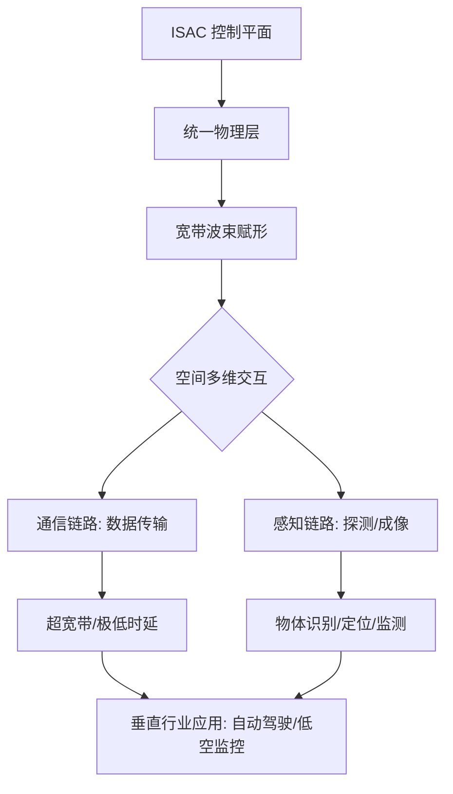

# 通感一体化 (Integrated Sensing and Communication, ISAC)

**通感一体化 (ISAC)** 是 6G 移动通信网络的核心愿景之一。它旨在将**无线通信**与**无线感知**功能集成在单一系统中，实现频谱、硬件资源和波形设计的深度融合。通过 ISAC 技术，通信网络不仅能传输数据，还能像雷达一样感知周围物体的距离、速度、方位和形状。

## 1. 核心技术原理 (Technical Principles)

ISAC 的实现依赖于通信与感知的协同演进，核心包括以下四个层面：

### 1.1 频谱共享 (Spectrum Sharing)
传统的感知（雷达）与通信通常工作在不同的频带。ISAC 提倡在同一频段（如毫米波、太赫兹或 U6G 频段）内同时执行两项任务，极大地提升了稀缺频谱资源的利用效率。

### 1.2 波形一体化 (Waveform Co-design)
*   **通信波形感知化**：在 OFDM（正交频分复用）波形中嵌入感知参考信号。
*   **感知波形通信化**：利用雷达脉冲序列调制低速控制信息。
*   **新型波形设计**：如 **OTFS (Orthogonal Time Frequency Space)**，在时延-多普勒域进行调制，对高频、高移动性场景表现出极佳的感知精度。

### 1.3 硬件架构共享 (Hardware Integration)
共享天线阵列、射频（RF）链路和模数转换器（ADC/DAC）。通过高增益、窄波束的毫米波天线，实现高分辨率的空间扫描。

### 1.4 信号处理与融合 (Fusion Processing)
在接收端，利用先进的信号处理算法（如自适应抵消、压缩感知）从通信流中提取环境回波，通过计算飞行时间 (ToF) 和多普勒频移，实现高精度的环境建模与目标识别。

## 2. 核心架构演进 (Architecture)

## 3. 典型应用场景 (Application Scenarios)

### 3.1 低空经济 (Low-altitude Economy)
*   **无人机监管**：基站通过感知信号实时监测无人机的飞行高度、轨迹和速度，解决“黑飞”监管难点。
*   **空域安全**：在关键空域建立虚拟感应围栏，确保低空飞行器的安全飞行。

### 3.2 智能交通与自动驾驶 (V2X)
*   **盲区探测**：路侧基站可以感知视觉传感器（摄像头、激光雷达）无法覆盖的盲区，提前预警横穿马路的行人。
*   **协同感知**：基站将感知的全局交通流量信息下发至车辆，提升整体交通流效率。

### 3.3 智慧城市与智能家居
*   **非接触式跌倒检测**：利用室内信号感知老人跌倒，无需摄像头，保护隐私。
*   **手势识别**：通过微多普勒效应，实现电视、家电的非接触式操控。

### 3.4 工业 4.0
*   **工厂定位**：提供厘米级的高精度室内定位，支持 AGV（自动导引运输车）在复杂环境中的精准导航。

## 4. 关键挑战 (Key Challenges)

1.  **自干扰管理 (Self-Interference)**：由于在同一频点发射和接收，发射机对接收机的泄漏干扰是影响感知灵敏度的最大瓶颈。
2.  **性能权衡 (Trade-off)**：通信追求高容量，感知追求高分辨率。如何在有限的资源下分配权重，需要动态调度算法。
3.  **标准化进程**：ISAC 是 6G 的关键技术，目前在 3GPP 和 ITU-R 的标准化讨论中仍处于早期研究（Study Item）阶段。

## 5. 关联知识
- [[AI-RAN技术全景指南]]：ISAC 往往部署在开放式无线接入网架构中，通过 AI 实现感知的智能化处理。
- [[5G-边缘云应用现状]]：边缘云为 ISAC 产生的海量感知数据提供本地化处理能力。

## 参考链接
- [ITU-R M.2160 (6G Vision)](https://www.itu.int/pub/R-REP-M.2160)
- [Huawei 6G White Paper: ISAC](https://www.huawei.com/en/technology-insights/6g)

## Update History
- 2026-03-27: 初次创建，涵盖定义、原理、架构及应用场景。
