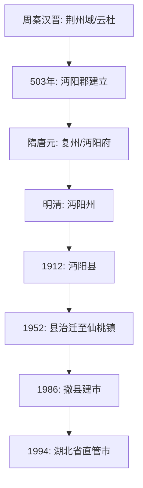

# 仙桃历史全景指南

仙桃市（原名沔阳）位于湖北省中部，江汉平原腹地。其历史可追溯至新石器时代，正式建制史逾1500年，是著名的“体操之乡”和荆楚文化重镇。

## 一、 行政区划演变

### 1. 古代时期：沔阳之源
*   **周秦汉晋**：周为勋国、州国地；春秋战国属楚；秦隶南郡；汉晋时期为云杜、竟陵之地。
*   **南朝梁（503年）**：梁武帝天监二年，始置**沔阳郡**，设沔阳县。因郡治位于沔水（今汉水）之北，故名“沔阳”。
*   **隋唐宋元**：曾多次在复州、沔州、沔阳郡之间更迭。元代升为**沔阳府**，属河南行省荆湖北路。

### 2. 明清时期：州县更迭
*   **明朝**：洪武九年降府为州，直属湖广布政司。
*   **清朝**：属安陆府。此时仙桃镇因汉江水运发达，逐渐成为区域商贸中心。

### 3. 近现代：从沔阳到仙桃
*   **1912年（民国）**：改沔阳州为**沔阳县**，县治位于沔城。
*   **1952年**：沔阳县治由沔城迁往**仙桃镇**。
*   **1986年**：撤销沔阳县，设立**仙桃市**。
*   **1994年**：湖北省人民政府批准仙桃市为**省直管市**。

## 二、 “仙桃”地名的由来

关于“仙桃”这一名称，民间与史料记载有三种主要说法：

1.  **地形说（桃形地）**：
    明代时，由于汉江与锦瑞河（今通海口至仙桃段）的冲积，该地地势呈现出一种自然的**桃形**，故名仙桃。
2.  **谐音说（尖刀嘴）**：
    早期该地在汉江边有一处险要的沙滩，形似尖刀，被称为“尖刀嘴”。因名字不够雅致，当地居民取其谐音改称为“仙桃”。
3.  **传说说（仙女献桃）**：
    相传有仙女手捧仙桃路过此地，不慎撒落，随后此地长出十里桃林，因此得名。

**历史记载**：嘉靖年间，此地设立官员管理船运，称“仙镇哨”，后演变为“仙桃市镇”。

## 三、 人口与社会概况 (2025年数据)

截至2024年末/2025年初统计：
*   **常住人口**：108.16 万人。
*   **户籍人口**：146.96 万人。
*   **城镇化率**：62.45%。

### 近年人口变化趋势
| 年份 | 常住人口 (万人) | 户籍人口 (万人) | 趋势 |
| :--- | :--- | :--- | :--- |
| 2020 (七普) | 114.01 | 152.92 | - |
| 2021/2022 | 110.51 | 151.51 | ↓ |
| 2023 | 109.32 | 150.04 | ↓ |
| 2024 | 108.16 | 146.96 | ↓ |

*   **人口特征**：仙桃是一个典型的劳务输出地，户籍人口显著多于常住人口。

## 四、 文化与特色

*   **荆楚文化**：仙桃是楚文化的核心区域之一，沔阳小曲、沔阳花鼓戏（国家级非遗）流传甚广。
*   **饮食文化**：以“沔阳三蒸”闻名天下。
*   **体操之乡**：仙桃培养了李小双、李大双、杨威、郑李辉等多位奥运冠军，被授予“中国体操之乡”称号。

## 五、 历史演变图示

## 参考链接
- [仙桃市人民政府 - 历史沿革](http://www.xiantao.gov.cn/)
- [红黑人口库 - 仙桃市人口](https://www.hongheiku.com/)

## Update History
- 2026-02-16: 根据用户请求，初次创建仙桃历史全景指南，整理了行政演变与地名由来。
- 2026-02-16: 更新了2024/2025年度的人口统计数据。
