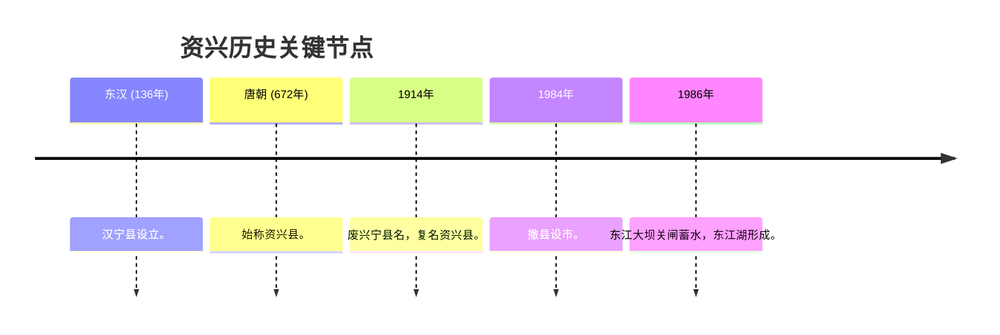

# 湖南资兴历史与概况全景指南

资兴市是湖南省辖县级市，由郴州市代管。它以“东江湖”风景名胜区闻名，同时也是中国重要的有色金属之乡和能源基地。

## 一、 行政区划与地名演变

### 1. 建制沿革
*   **东汉（136年）**：析郴县置**汉宁县**，这是资兴建制之始。
*   **唐朝（672年）**：咸亨三年，正式定名为**资兴县**，因境内资兴水（今资兴江）得名。
*   **宋元明清**：期间曾多次更名，如**泰县**、**兴宁县**。
*   **1914年**：因与广东兴宁县重名，复名**资兴县**。
*   **1984年**：撤县设市。

### 2. 区划现状
*   **驻地**：唐洞街道。
*   **辖区**：下辖2个街道、9个镇、2个民族乡（回龙山瑶族乡、八面山瑶族乡）。

## 二、 东江湖与移民历史

东江湖是资兴的灵魂，它的背后是一段沉重的“移民史”：
*   **工程背景**：上世纪七八十年代，为建设国家重点水利工程——**东江水电站**。
*   **大规模移民**：11个乡镇的近**6万人口**为了大坝关闸蓄水，舍弃了世代居住的肥沃土地和家园。
*   **移民精神**：资兴设有**东江移民博物馆**，记录了这段“舍小家、为国家”的悲壮历程。

## 三、 人口与社会概况 (2025年数据)

*   **常住人口**：约 **31.27 万人**（截至2025年初统计）。
*   **城镇化率**：约 **68.53%**。

### 近年人口变化趋势
| 年份 | 常住人口 (万人) | 趋势 |
| :--- | :--- | :--- |
| 2020 (七普) | 32.30 | - |
| 2022 | 31.95 | ↓ |
| 2023 | 31.64 | ↓ |
| 2024 | 31.27 | ↓ |

*   **人口较少的原因分析**：
    1.  **地形限制**：资兴境内以山地为主，八面山等脉络纵横，土地承载能力天然弱于平原地区。
    2.  **水域占位**：东江湖（160平方公里水面）占据了大量原本的平原耕地，限制了农业人口规模。
    3.  **移民历史**：上世纪80年代东江水电站建设淹没了11个乡镇，虽然进行了后靠安置，但生产资料的损失影响了人口的自然增长。
    4.  **产业转型与外流**：从“煤电之都”向“生态旅游”转型过程中，传统工矿业人口减少，加上紧邻郴州市区且靠近珠三角，劳动力外流现象明显。

## 四、 文化与旅游特色

*   **东江湖**：国家5A级景区，以“雾漫小东江”奇观享誉中外。
*   **矿冶文化**：作为有色金属之乡，拥有悠久的采矿历史。
*   **瑶族风情**：回龙山、八面山保留了丰富的瑶族民俗文化。

## 五、 历史演变简图

## 参考链接
- [资兴市人民政府](http://www.zixing.gov.cn/)
- [东江移民博物馆介绍](http://www.zixingxinwen.com/)

## Update History
- 2026-02-16: 初次创建资兴历史与概况指南。
