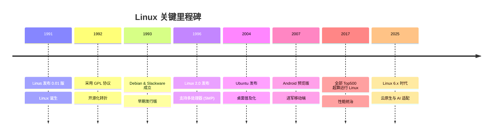

# Linux 发展史详解：从个人爱好到全球基石

Linux 的成功不仅是技术的胜利，更是**开源协作模式**的胜利。

## 1. 诞生与初心 (1991)
*   **1991年8月25日**：21岁的芬兰大学生 **Linus Torvalds** 在 MINIX 新闻组发布了那封著名的邮件：“I'm doing a (free) operating system (just a hobby, won't be big and professional like gnu)...”
*   **1991年9月**：发布 Linux 0.01 版本，仅有一万多行代码。

## 2. 开源化的关键转折 (1992 - 1994)
*   **GPL 协议 (1992)**：Linus 决定将 Linux 重新授权为 **GNU GPL** 协议。这是 Linux 历史上最重要的决定，它确保了代码的自由传播与集体改进。
*   **1.0 发布 (1994)**：代码量达到 17.6 万行，标志着 Linux 成为一个真正可用的操作系统。

## 3. 商业化与发行版的崛起 (1993 - 1999)
*   **早期三巨头**：
    *   **Slackware (1993)**：现存最古老的发行版。
    *   **Debian (1993)**：坚持纯粹开源精神的社区支柱。
    *   **Red Hat (1994)**：开启了 Linux 的商业化探索。
*   **吉祥物 Tux (1996)**：那只著名的企鹅正式成为 Linux 的标志。
*   **企业入场 (1998)**：IBM、Oracle 和 Compaq 宣布支持 Linux，标志着其进入企业级市场。

## 4. 走向桌面与移动端 (2000 - 2010)
*   **桌面战争**：**GNOME** 和 **KDE** 的成熟让 Linux 开始具备挑战 Windows 桌面的潜力。
*   **Ubuntu 诞生 (2004)**：基于 Debian，以“人性化”为核心，极大降低了 Linux 的使用门槛。
*   **Git 的诞生 (2005)**：Linus 为了管理内核代码开发了 Git，顺便颠覆了全球的代码管理方式。
*   **Android 震撼 (2007)**：基于 Linux 内核的 Android 发布，随后成为全球装机量第一的移动操作系统。

## 5. 统治云端与未来 (2011 至今)
*   **云基础设施**：Linux 成为 AWS、Azure 和 Google Cloud 的绝对首选，容器技术（Docker/K8s）进一步巩固了其地位。
*   **性能巅峰**：全球 500 强超级计算机全部运行在 Linux 之上。
*   **内核演进**：
    *   **3.x (2011)**：20周年纪念版。
    *   **5.x (2020)**：强化了对 WireGuard VPN 和新硬件的支持。
    *   **6.x (现代)**：重点在于异构计算和 AI 硬件的适配。

## Linux 发展里程碑图谱 (Mermaid)

## 参考链接
- [Linux Kernel 官方归档](https://www.kernel.org/)
- [Wikipedia: History of Linux](https://en.wikipedia.org/wiki/History_of_linux)
- [TuxCare: Linux Milestones](https://tuxcare.com/)

## Update History
- 2026-02-13: 初次创建，系统梳理 Linux 从 1991 年至今的发展脉络。
