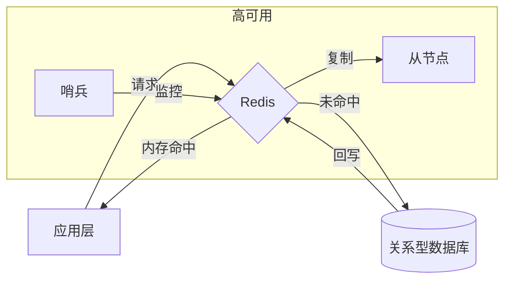

# Redis 核心基础与 2026 应用指南

Redis (Remote Dictionary Server) 是一款开源的内存数据结构存储系统。在 2026 年的架构设计中，它已从单纯的缓存层进化为支持 AI 向量检索、实时流处理的多模态实时数据平台。

## 1. 核心技术特点

### 1.1 存储与性能
*   **全内存存储**：数据驻留在 RAM，读写响应时间为亚毫秒级（Microseconds）。
*   **IO 多路复用**：利用单线程（核心处理逻辑）避免上下文切换开销，同时在 6.0+ 引入多线程 IO 处理网络请求。
*   **高性能表现**：Redis 8 版本在吞吐量上较 7 版本有显著提升（约 2x）。

### 1.2 数据结构多样性
*   **基础类型**：`Strings`, `Hashes`, `Lists`, `Sets`, `Sorted Sets`。
*   **概率性结构**：`Bloom Filter`（布隆过滤器）、`HyperLogLog`（基数统计）。
*   **流式处理**：`Streams` 支持消息偏移、消费组，功能接近轻量级 Kafka。
*   **AI 扩展**：支持 **Vector Sets**（向量集），用于存储 Embedding 并进行 KNN/ANN 搜索。

### 1.3 持久化与可靠性
*   **RDB (Redis Database)**：定时生成全量快照，恢复快，但有数据丢失风险。
*   **AOF (Append Only File)**：记录每个写命令，数据安全性高，支持重写压缩。
*   **高可用**：通过 **Redis Sentinel** 实现自动故障转移；通过 **Redis Cluster** 实现分布式分片。

## 2. 生产环境主要用途

### 2.1 传统经典场景
1.  **高性能缓存**：减轻数据库负载，存储热点数据。
2.  **会话存储 (Session Storage)**：分布式系统中的统一 Session 中心。
3.  **计数器与排行榜**：利用原子递增（INCR）和有序集合（ZSET）处理高并发计数。

### 2.2 现代架构场景 (2025-2026 重点)
1.  **AI 智能体内存 (Agent Memory)**：
    *   作为 LLM 的长期/短期记忆存储。
    *   **语义缓存 (Semantic Cache)**：通过向量匹配缓存 LLM 的回答，显著降低 Token 消耗。
2.  **分布式任务调度**：利用 `Lists` 或 `Streams` 作为轻量级消息队列。
3.  **实时地理位置服务 (LBS)**：利用 `GEO` 命令处理打车、外卖等位置查询。

## 3. 生产环境最佳实践 (Best Practices)

*   **Key 命名规范**：推荐使用 `业务名:表名:ID` 格式（如 `user:profile:1001`）。
*   **避免大 Key**：单个 Hash 或 List 成员过多会阻塞单线程，建议拆分。
*   **禁止使用 KEYS 命令**：在生产环境严禁执行 `KEYS *`，应使用 `SCAN` 代替以防系统卡死。
*   **设置过期时间 (TTL)**：任何非永久数据必须设置 TTL，防止内存撑爆。

## 4. 架构示意图

## 参考链接
- [Redis 官方文档](https://redis.io/docs/)
- [Redis 8 新特性解析](https://redis.io/blog/)
- [LangCache: 语义缓存实践](https://github.com/redis/langcache)

## Update History
- 2026-02-08: 初次创建，涵盖 Redis 8 最新特性及 AI 语义缓存应用。
