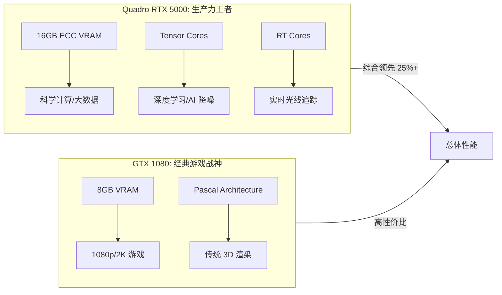

# GPU 对比：Quadro RTX 5000 vs GeForce GTX 1080

这是一场跨越架构（Turing vs Pascal）和应用领域（专业 vs 游戏）的深度对比。

## 1. 规格参数详表

| 特性 | Quadro RTX 5000 | GeForce GTX 1080 | 差距 |
| :--- | :--- | :--- | :--- |
| **架构** | Turing (TU104) | Pascal (GP104) | 领先 2 代 |
| **显存** | 16 GB GDDR6 (ECC) | 8 GB GDDR5X | 显存容量翻倍 |
| **CUDA 核心** | 3072 | 2560 | +20% |
| **Tensor Cores** | 384 | 0 | AI 算力代差 |
| **RT Cores** | 48 | 0 | 光追硬件支持 |
| **FP32 TFLOPS** | ~11.2 | ~8.9 | 理论算力 +25% |

## 2. 核心技术对比

### 2.1 架构代差 (The Turing Advantage)
- **DLSS 支持**：RTX 5000 支持 AI 超采样技术，在运行支持的游戏或专业软件时性能大幅提升。
- **Ray Tracing**：RTX 5000 具备硬件光线追踪核心，适合实时渲染预览。

### 2.2 专业领域特性
- **ECC 显存**：RTX 5000 的 16GB 显存支持纠错，适合科学计算与长时间渲染。
- **ISV 驱动优化**：Quadro 驱动在 AutoCAD、Maya、CATIA 等软件中提供 10bit 色彩支持和针对特定场景的性能加速。

## 3. 性能可视化 (Mermaid)

## 4. 延伸对比：老一代专业卡 vs 经典游戏卡 (M5000M vs GTX 1080)

在讨论 HP ZBook 17 G3 时，常涉及 **Quadro M5000M**。

| 维度 | Quadro M5000M (G3 顶配) | GeForce GTX 1080 | 结论 |
| :--- | :--- | :--- | :--- |
| **架构** | Maxwell (2015) | Pascal (2016) | GTX 1080 架构领先一代 |
| **核心数** | 1536 CUDA | 2560 CUDA | GTX 1080 规模高 66% |
| **浮点算力** | ~3.0 TFLOPS | ~8.9 TFLOPS | GTX 1080 高近 3 倍 |
| **实际表现** | 相当于台式机 GTX 970/980M | 当年的顶级旗舰 | **GTX 1080 全方位碾压** |

## 5. 中端平衡选型：Quadro RTX 3000 (Turing 架构)

在 ZBook 17 G6 等型号中常见，是 RTX 5000 的“平替”。

| 维度 | Quadro RTX 3000 | 对标消费级显卡 | 性能水平 |
| :--- | :--- | :--- | :--- |
| **显存** | 6GB GDDR6 | RTX 2060 Mobile / GTX 1660 Ti | 中端甜品级 |
| **CUDA 核心** | 1920 | - | RTX 5000 的 ~60% 规模 |
| **特色** | 支持光追 (RT) / AI (Tensor) | - | 具备现代 AI 算力 |

### 5.1 入门专业级：Quadro T2000
在轻量化工作站中常见（如 ZBook 15 G6/Studio）。
*   **架构**：Turing (无 RT/Tensor 核心)。
*   **显存**：4GB GDDR5/GDDR6。
*   **对标**：GeForce **GTX 1650 Ti**。
*   **评价**：适合基础 2D/3D 设计，但在光追渲染和 AI 加速任务中表现乏力。

**结论**：RTX 3000 适合 1080p 下的 3D 设计与剪辑，虽显存较小，但拥有现代架构核心，在 AI 工具（如 AI 降噪、补帧）上表现远好于老款 Pascal/Maxwell 卡。

## 6. 最终结论与选型
- **选 RTX 5000**：如果你从事视频剪辑 (8K)、AI 模型推理、3D 重度建模、或者需要 10bit 色彩输出进行精准调色。
- **选 GTX 1080**：如果你主要进行 1080p 下的竞技类游戏，且预算极其有限（目前仅存在于二手市场）。

## 参考链接
- [NVIDIA Quadro RTX 5000 Specifications](https://www.nvidia.com/en-us/design-visualization/quadro/rtx-5000/)
- [[HP-ZBook-17-配置指南]]

## Update History
- 2026-04-11: 增加 Quadro T2000 入门级专业卡对比。
- 2026-04-11: 增加 Quadro RTX 3000 中端显卡水平分析。
- 2026-04-11: 增加 Quadro M5000M 与 GTX 1080 的横向对比，强调 Pascal 架构代差。
- 2026-04-11: 初次创建。
