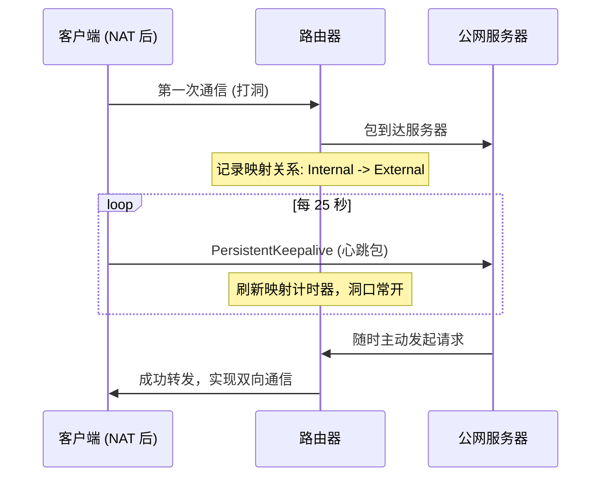

# WireGuard 协议详解

WireGuard 是一种现代、高性能的 VPN 协议，旨在通过极简的设计和先进的加密算法，在性能和安全性上全面超越传统的 OpenVPN 和 IPsec。

## 1. 核心定义与设计理念

WireGuard 是由 Jason A. Donenfeld 开发的一种新型开源 VPN 协议。它的核心设计目标是：
*   **极致简洁**：代码量仅约 4,000 行，极易审计，安全性高。相比之下，OpenVPN 约有 100,000 行代码。
*   **现代加密**：强制使用最先进的加密算法，不保留过时的遗留算法（如 3DES, MD5）。
*   **高性能**：运行在内核空间（Linux 5.6+ 集成），支持多核并行。

## 2. 技术特性与原理

### 2.1 隐密路由 (CryptoKey Routing)
WireGuard 采用了类似于 SSH 的公钥认证机制。每个对等体（Peer）都有一个公钥和一个允许的 IP 列表（Allowed IPs）。
*   如果从隧道发送包，WireGuard 会通过目的 IP 查找对应的公钥进行加密。
*   如果从隧道接收包，WireGuard 会验证其签名并确其内网 IP 是否在对应的 Allowed IPs 列表中。

### 2.2 现代加密套件
WireGuard 强制使用以下组合：
*   **ChaCha20**：对称加密。
*   **Curve25519**：密钥交换。
*   **Poly1305**：数据认证。
*   **BLAKE2s**：哈希计算。

### 2.3 NAT 穿透与双向通信 (PersistentKeepalive)
WireGuard 基于 UDP 协议且默认“无状态”静默。为了在 NAT（路由器）后实现随时随地的双向通信，必须理解 `PersistentKeepalive` 机制：

*   **问题**：位于 NAT 后的设备如果不主动发包，路由器会关闭 UDP 端口映射，导致公网 Peer 无法主动推数据。
*   **解决**：在 NAT 后的 Peer 配置文件中添加 `PersistentKeepalive = 25`。
*   **效果**：设备每隔 25 秒发送一个心跳包，维持路由器的“洞口”开启，从而实现服务器随时可以发起对客户端的连接。

## 3. 性能博弈与对比

| 特性 | WireGuard | OpenVPN | IPsec (IKEv2) |
| :--- | :--- | :--- | :--- |
| **吞吐量 (Speed)** | **最高** | 较低 | 高 |
| **延迟 (Latency)** | **极低** | 高 | 低 |
| **连接速度** | **瞬时 (<100ms)** | 慢 (2-10s) | 中 (1-3s) |
| **漫游能力** | **极强** (IP 变动不断开) | 弱 | 强 |

## 4. 优势与局限

### 4.1 优势
1.  **极简性**：代码库极小，减少了攻击面。
2.  **移动端友好**：原生支持 IP 漫游（Wi-Fi/4G 切换不断连）。
3.  **配置简单**：无需繁杂的证书链管理。

### 4.2 局限性
1.  **UDP 协议限制**：仅支持 UDP。
2.  **无混淆机制**：流量特征明显，易被 DPI 识别。

## 参考链接
- [WireGuard 官网](https://www.wireguard.com/)
- [WireGuard 白皮书](https://www.wireguard.com/papers/wireguard.pdf)

## Update History
- 2026-02-26: 初次创建。
- 2026-02-26: 补充 PersistentKeepalive 机制与双向通信原理。
