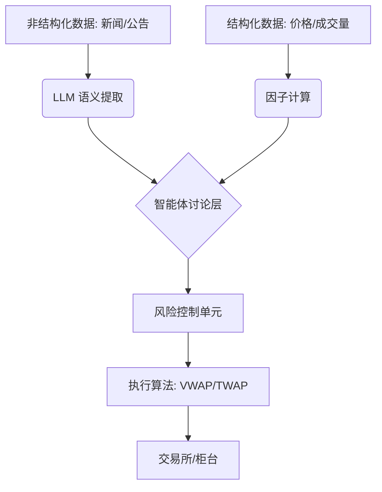

# LLM 在量化交易中的应用全景指南

随着 Transformer 架构（参见 [[Transformer架构详解]]）的普及，量化交易正在从“特征工程驱动”向“语义理解驱动”转型。LLM 在金融领域的角色已不再仅是聊天机器人，而是演变为自动化研究和决策的核心组件。

## 1. 核心应用场景

### 1.1 非结构化数据挖掘 (Alpha 挖掘)
- **情绪分析**：实时处理社交媒体（Twitter/Reddit）、新闻流，识别超额收益机会。
- **文档洞察**：自动对比财报中的措辞微调（如“稳健”变为“挑战”），捕捉管理层隐性信号。
- **宏观情报**：解析央行纪要和地缘政治事件，预测政策转向。

### 1.2 策略生成与代码自动化
- **自然语言策略转代码**：将“当 RSI 低于 30 且成交量放大时买入”等策略描述直接转化为 Python 回测代码。
- **因子搜索自动化**：LLM 可以阅读学术论文并自动实现其中的数学因子，极大地提升研究效率。

### 1.3 多智能体协作系统 (Multi-Agent System)
利用多智能体框架（如 AutoGPT, LangGraph），构建拟人化的投委会：
- **基本面智能体**：关注估值与财报。
- **技术面智能体**：关注均线、动量。
- **风险智能体**：实时监控回撤与敞口。
最后由**执行智能体**汇总决策。

## 2. 模型选择与训练策略 (2025 最佳实践)

在实际落地中，通常不需要从头训练模型，而是根据需求选择不同的增强策略：

### 2.1 公开大模型 (Direct Use)
- **适用场景**：快速原型、代码编写辅助、通用的宏观逻辑分析。
- **推荐模型**：GPT-4o, Claude 3.5 Sonnet, DeepSeek-V3。
- **局限**：缺乏时效性数据，金融专业推理可能出现偏差。

### 2.2 检索增强生成 (RAG)
- **核心逻辑**：模型推理前，先从本地/实时数据库（如 [[Faiss引擎详解]]）检索最新的财报、新闻、价格，作为 Context 喂给模型。
- **优势**：**成本最低、时效最强**。能有效解决模型“幻觉”问题。
- **地位**：量化交易系统的标配架构。

### 2.3 轻量化微调 (PEFT/LoRA)
- **核心逻辑**：使用少量（几千条）高质量金融标注数据，对开源模型（如 Llama-3-8B）进行参数微调。
- **优势**：在特定任务（如金融情感评分、研报实体提取）中，性能可提升 30%-60%，甚至超越更大的通用模型。
- **成本**：使用消费级 GPU（如 RTX 4090）即可在几小时内完成。

## 3. 主流金融大模型对比

| 模型名称 | 开发机构 | 特点 | 适用场景 |
| :--- | :--- | :--- | :--- |
| **FinGPT** | 开源社区 | 侧重情绪分析与强化学习，成本低 | 个人开发者、情绪因子研究 |
| **BloombergGPT** | Bloomberg | 专有金融数据训练，NLP 性能极强 | 专业机构、财报深度解析 |
| **Claude/GPT-4** | Anthropic/OpenAI | 推理能力顶级，支持长文本 RAG | 策略回测、复杂逻辑分析 |

## 4. 技术瓶颈与风险

### 4.1 幻觉问题 (Hallucination)
LLM 可能会自信地捏造财务指标或新闻事件。
- **对策**：引入 RAG (检索增强生成) 系统，确保模型回答基于 [[Faiss引擎详解]] 检索出的真实公告。

### 4.2 延迟挑战 (Latency)
LLM 的推理通常需要秒级时间，无法直接用于高频交易 (HFT)。
- **对策**：用于中长线择时，或通过模型蒸馏 (Distillation) 生成小模型（参见 [[大模型蒸馏技术详解]]）。

### 4.3 市场动态性 (Data Drift)
金融数据具有极强的非平稳性。
- **对策**：采用持续学习 (Continuous Learning) 或在线微调策略。

## 5. 从知识检索到智能体决策 (Agentic RAG)

要让 LLM 做出可靠的决策，系统必须从简单的“问答模式”进化为“代理模式”：

### 5.1 智能体决策工作流
1.  **意图拆解**：将“分析某股票”拆解为：检索新闻、获取价格、分析财务指标、执行风控检查。
2.  **自主检索**：模型判断当前信息是否足以决策，若不足则发起多轮检索。
3.  **思维链推理 (CoT)**：通过“Step-by-step”推理，将检索到的非结构化信息（如情绪）与结构化数据（如技术指标）进行加权融合。
4.  **风险护栏 (Guardrails)**：在输出最终 `BUY/SELL` 信号前，通过硬编码的合规性检查（如仓位控制、止损线）。

### 5.2 决策可靠性评估 (RAGAS 框架)
评估决策是否可靠的三个核心指标：
- **忠实度 (Faithfulness)**：决策是否完全基于检索到的证据，而非幻觉。
- **答案相关性 (Answer Relevance)**：决策是否直接响应了市场动态。
- **上下文充分性 (Context Sufficiency)**：检索到的资料是否足以支撑当前的买卖逻辑。

## 6. 决策模式选择：自主决策 vs. 策略约束

在实战中，开发者需要在“灵活性”与“纪律性”之间做出选择：

### 6.1 纯自主决策 (Autonomous Bias)
- **原理**：LLM 直接输出 `{"action": "BUY", "reason": "..."}`。
- **评价**：风险极高。由于 LLM 存在“指令漂移”和“幻觉”，不建议在没有硬风控的情况下直接接入实盘。

### 6.2 策略约束模式 (Constrained Logic) - **推荐**
- **原理**：LLM 仅负责提取特征（如：情绪得分、事件分类），决策由硬编码的逻辑执行。
- **示例工作流**：
    1. **LLM 预处理**：分析新闻 -> 输出 `Sentiment_Score: 0.85`。
    2. **传统逻辑**：`if Sentiment_Score > 0.8 and MA20 > MA60: Execute_Trade()`。

### 6.3 策略生成 (Strategy Discovery)
利用 LLM 分析历史数据与新闻的关联，自动生成可回测的量化规则。这使得 LLM 成为“研究员”而非“交易员”。

## 7. 推荐架构图 (Mermaid)

## 9. LLM 量化任务决策矩阵 (Quick Reference)

为了帮助开发者快速评估任务可行性，以下是基于 2025 年技术水平的决策矩阵：

| 任务类型 | 是否适合 LLM？ | 建议方案 |
| :--- | :--- | :--- |
| **高频下单 / 撤单** | ❌ 不适合（响应太慢） | C++ / FPGA 硬件执行 |
| **预测精确股价 (如 10.51)** | ❌ 不适合（易产生幻觉） | LSTM / XGBoost / Transformer 数值模型 |
| **分析财报里的隐藏风险** | ✅ **最适合** | LLM + RAG |
| **将研报转化为情绪分** | ✅ **最适合** | FinGPT / GPT-4o |
| **编写回测代码/策略原型** | ✅ **最适合** | GitHub Copilot / LLM |

## 10. 学习建议
1.  **掌握提示工程**：学习 [[Prompt优化与Token减支策略]] 以降低 API 成本。
2.  **了解向量数据库**：学习 [[开源向量数据库对比]] 以构建金融知识库。
3.  **关注 Agent 运行机制**：参考 [[Agent运行机制详解]]。

## 参考链接
- [FinGPT GitHub Repo](https://github.com/AI4Finance-Foundation/FinGPT)
- [BloombergGPT Technical Report](https://arxiv.org/abs/2303.17564)

## Update History
- 2026-02-12: 深度补充 Agentic RAG 工作流与混合决策模式对比。
